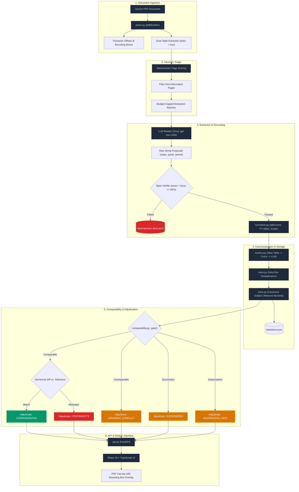
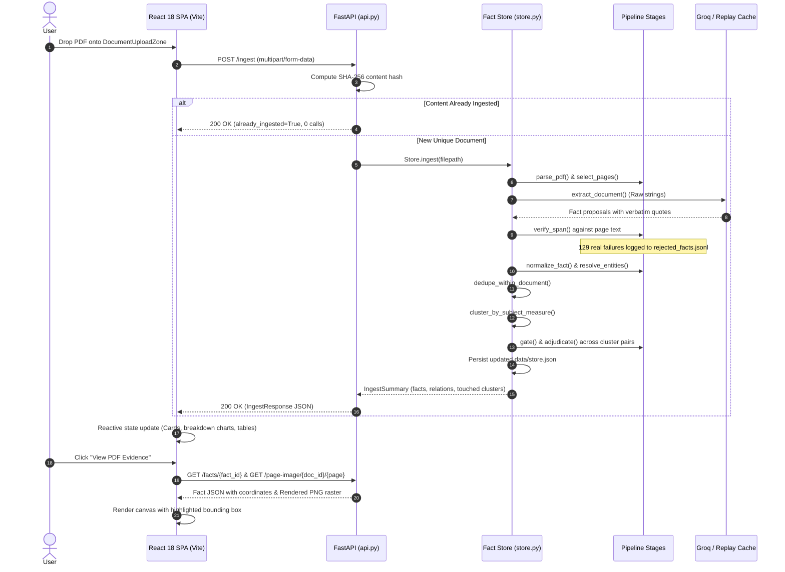

# Fact Layer
### Evidence-Grounded Fact Extraction & Cross-Document Reasoning Engine

[](https://www.python.org/)
[](https://fastapi.tiangolo.com/)
[](https://react.dev/)
[](https://www.typescriptlang.org/)
[](https://vitejs.dev/)
[](https://tailwindcss.com/)
[](#test-suite--validation)
[](#offline-reproducibility-via-replay-cache)

> **Core Thesis: Comparability Before Comparison**  
> Numerical equality or inequality is meaningless until semantic comparability has been established. Fact Layer refuses to diff values until period, scope, unit, modality, and issuer qualifiers are proven compatible.

**Fact Layer** is an evidence-first knowledge extraction and cross-document reasoning system for unstructured PDF documents. It parses complex filings (corporate prospectuses, annual reports, quarterly earnings, and central bank/macroeconomic reports), extracts structured facts, grounds every accepted fact to verbatim quotes verified against source text with pixel-level PDF coordinates, and adjudicates relational agreements and conflicts using a deterministic comparability gate.

The repository includes:
1. **Python Pipeline Engine (`fact_layer/`)**: A modular 10-stage pipeline with deterministic triage, schema-constrained LLM extraction, mechanical span verification, locale-aware normalization, and multi-tier canonicalization.
2. **FastAPI Service Layer (`api.py`)**: 10 REST endpoints supporting incremental ingestion, querying, and coordinate-mapped PDF rendering.
3. **React + TypeScript Frontend (`frontend/`)**: A modern SPA built with Vite, Tailwind CSS, and Lucide icons, featuring dark/light theming, an interactive PDF evidence viewer with coordinate bounding-box overlays, relation inspection modals, and qualifier diff matrices.
4. **Offline Replay Cache (`cache/llm/`)**: A committed cache enabling 100% offline reproducibility with zero API keys and zero network calls.

---

## Table of Contents

- [1. Why This Exists: The Problem of Naive Comparison](#1-why-this-exists-the-problem-of-naive-comparison)
- [2. System Capabilities: What the System Does](#2-system-capabilities-what-the-system-does)
- [3. Core Design Principles](#3-core-design-principles)
- [4. System Architecture](#4-system-architecture)
  - [4.1 Pipeline Architecture Flowchart](#41-pipeline-architecture-flowchart)
  - [4.2 Ingest Request Lifecycle](#42-ingest-request-lifecycle)
- [5. Frontend Architecture & Modern UI Stack](#5-frontend-architecture--modern-ui-stack)
- [6. Pipeline Stages Walkthrough](#6-pipeline-stages-walkthrough)
  - [Stage 1: PDF Parsing (`parse.py`)](#stage-1-pdf-parsing-parsepy)
  - [Stage 2: Deterministic Page Triage (`triage.py`)](#stage-2-deterministic-page-triage-triagepy)
  - [Stage 3: Schema-Constrained Extraction (`extract.py`)](#stage-3-schema-constrained-extraction-extractpy)
  - [Stage 4: Mechanical Span Verification](#stage-4-mechanical-span-verification)
  - [Stage 5: Locale-Aware Normalization (`normalize.py`)](#stage-5-locale-aware-normalization-normalizepy)
  - [Stage 6: Multi-Tier Entity & Measure Resolution (`resolve.py`)](#stage-6-multi-tier-entity--measure-resolution-resolvepy)
  - [Stage 7: Intra-Document Deduplication (`store.py`)](#stage-7-intra-document-deduplication-storepy)
  - [Stage 8: Semantic Clustering (`store.py`)](#stage-8-semantic-clustering-storepy)
  - [Stage 9: The Comparability Gate (`comparability.py`)](#stage-9-the-comparability-gate-comparabilitypy)
  - [Stage 10: Relational Adjudication (`adjudicate.py`)](#stage-10-relational-adjudication-adjudicatepy)
- [7. The Five Relational Verdicts](#7-the-five-relational-verdicts)
- [8. The Four Required Benchmark Cases](#8-the-four-required-benchmark-cases)
  - [Case 1: Corroboration (Cross-Institution Macro Alignment)](#case-1-corroboration-cross-institution-macro-alignment)
  - [Case 2: Contradiction (Intra-Document ESOP Vesting Conflict)](#case-2-contradiction-intra-document-esop-vesting-conflict)
  - [Case 3: Apparent Conflict (Live Forecast Disagreement)](#case-3-apparent-conflict-live-forecast-disagreement)
  - [Case 4: Extraction Failure (Mechanically Logged Rejections)](#case-4-extraction-failure-mechanically-logged-rejections)
- [9. Measured Metrics & Corpus Statistics](#9-measured-metrics--corpus-statistics)
- [10. Empirical Scale & Stress Testing](#10-empirical-scale--stress-testing)
- [11. Quickstart & Setup Guide](#11-quickstart--setup-guide)
- [12. API Reference](#12-api-reference)
- [13. Honest Limitations & Engineering Post-Mortems](#13-honest-limitations--engineering-post-mortems)
- [14. Developer Submission Checklist](#14-developer-submission-checklist)

---

## 1. Why This Exists: The Problem of Naive Comparison

Financial reports and macroeconomic surveys constantly restate facts across prospectuses, annual reports, and investor presentations. Reconciling them automatically is a notorious failure mode for naive RAG systems and LLM triple-extractors `(subject, predicate, object)`.

When an automated pipeline compares two values directly:

$$ \text{Revenue}_A = X \quad \text{vs.} \quad \text{Revenue}_B = Y $$

...a simple numerical difference is routinely flagged as a contradiction:

| Fact A | Fact B | Naive Verdict | What Is Actually True | Root Cause |
|---|---|---|---|---|
| Revenue ₹120.4 Cr (FY24) | Revenue ₹32.1 Cr (Q1 FY25) | **Contradiction** | Both figures are correct. | Disjoint time windows (full fiscal year vs. single quarter). |
| Revenue ₹120.4 Cr (Standalone) | Revenue ₹145.9 Cr (Consolidated) | **Contradiction** | Both figures are correct simultaneously. | Accounting boundary divergence (legal entity vs. corporate group). |
| GDP Growth 6.5% (RBI) | GDP Growth 7.8% (IMF) | **Contradiction** | Legitimate institutional disagreement. | Forecasts from two distinct macroeconomic institutions. |
| ₹12,040 (in lakhs) | ₹120.4 Cr | **Contradiction** | Mathematically identical values. | Scale and unit representation differences. |

A bare `(subject, predicate, object)` triple strips away the essential context—**reporting period, scope, scale, currency, modality, and issuer**—needed to determine whether two numbers are comparable.

### The Antidote: A Fact is a Claim Plus Its Qualifiers

In Fact Layer, facts are modeled as rich multi-dimensional records (`fact_layer/models.py`):

```
Fact
├── subject: str               Canonical entity (e.g. "Delhivery Limited")
├── measure: str               Canonical attribute (e.g. "revenue_from_operations")
├── value: Quantity            Canonical numerical value, units, scale, and sig_figs
├── qualifiers: Qualifiers
│   ├── period: Period         Structured fiscal interval (e.g., FY24: 2023-04-01 → 2024-03-31)
│   ├── as_of: date            Point-in-time anchor (for balance sheet/stock figures)
│   ├── scope: Scope           STANDALONE | CONSOLIDATED | SEGMENT
│   ├── basis: Basis           AUDITED | UNAUDITED | PROVISIONAL
│   ├── segment: str           Specific business line or division
│   ├── geography: str         Geographic boundary
│   └── issuer: str            Reporting institution (e.g. "RBI", "IMF", "Delhivery")
├── modality: Modality         ASSERTED | ESTIMATED | PROJECTED | RESTATED
├── evidence: list[Evidence]   Doc ID, page, char span, verbatim quote, verified flag, bbox
└── confidence: float          Deterministic confidence score [0.0, 1.0]
```

---

## 2. System Capabilities: What the System Does

Fact Layer separates mechanical reading from deterministic reasoning:

- **Deterministic PDF Ingestion & Geometry**: Extracts text, tables, character offsets, and pixel-exact bounding boxes (`Page.bbox_for_span()`) using `pdfplumber`.
- **Heuristic Page Triage**: Mathematically scores pages before touching an LLM, reducing 511 corpus pages down to 105 extraction calls (a 5× budget reduction).
- **Schema-Constrained LLM Extraction**: Uses Groq (`openai/gpt-oss-120b`) purely as a text reader. The model extracts raw strings; it is never permitted to calculate, convert, or infer numbers.
- **Strict Anti-Hallucination Span Verification**: Every extracted quote is mechanically verified against raw source text using exact and fuzzy ($\ge 92\%$) matching. Unverified quotes are permanently rejected and logged.
- **Locale-Specific Normalization**: Deterministic Python converts Indian numbering systems (lakhs, crores), Indian fiscal years (April–March), and accounting scopes without model uncertainty.
- **Multi-Tier Canonicalization**: Maps non-standardized strings into shared canonical keys through deterministic rules, declarative alias tables, fuzzy scoring, and a capped LLM fallback.
- **Deterministic Comparability Gate**: An 8-step skeptic engine checks period, scope, unit, and issuer compatibility *prior* to numerical evaluation.
- **Contextual Conflict Explanations**: Differentiates between true mathematical contradictions and expected forecast variances, generating plain-English audit trails.
- **Incremental Ingestion**: Uploading a PDF updates only affected clusters without recomputing unrelated document relations.
- **Interactive Evidence Provenance UI**: A modern React SPA with PDF canvas rendering, bounding-box overlays, zoom controls, and theme switching.

---

## 3. Core Design Principles

### Principle 1: Evidence First
A claim without verifiable evidence is considered non-existent. Every accepted fact contains a verbatim quote pinned to a document ID, page number, and character span. If an LLM paraphrases a table into fluent text that cannot be verified against contiguous page bytes, the fact is rejected and written to `data/rejected_facts.jsonl`.

### Principle 2: Comparability Before Comparison
The system refuses to compute $\Delta = |V_1 - V_2|$ until the comparability gate has exhausted all potential qualifier mismatches. The gate acts as a skeptic; the adjudicator acts only after the gate finds no structural objection.

### Principle 3: The Model Reads; Python Reasons
Language models struggle with reliable arithmetic across currency scales and fiscal calendars. In Fact Layer:
- **LLM**: Emits raw strings (`"120.4 crore"`, `"FY2023-24"`, `"standalone"`).
- **Python**: Parses strings into typed `Quantity` and `Period` objects, converts units, checks date overlaps, and evaluates equality.

### Principle 4: Explicit Uncertainty
When documents omit qualifiers (e.g., omitting reporting periods in statistical annexes), Fact Layer penalizes confidence scores (e.g., halving confidence on contradictions to 0.475) and attaches explicit audit flags (`_period_unverified`) rather than guessing missing metadata.

---

## 4. System Architecture

### 4.1 Pipeline Architecture Flowchart



### 4.2 Ingest Request Lifecycle



---

## 5. Frontend Architecture & Modern UI Stack

The frontend is a dedicated React 18 application built with TypeScript, Vite, and Tailwind CSS. It replaced the original prototype while preserving backend API contracts.

```
frontend/
├── src/
│   ├── components/
│   │   ├── cases/               # 4 Required benchmark case studies
│   │   │   └── RequiredCasesPage.tsx
│   │   ├── clusters/            # Fact clusters grouped by subject::measure
│   │   │   └── ClustersPage.tsx
│   │   ├── common/              # Reusable design primitives
│   │   │   ├── AboutModal.tsx       # System thesis & architecture reference
│   │   │   ├── ConfidencePill.tsx   # Color-coded confidence badges
│   │   │   ├── EmptyState.tsx       # Standard empty data states
│   │   │   ├── LoadingSkeleton.tsx  # Pulse skeleton loaders
│   │   │   ├── Modal.tsx            # Accessible modal container with backdrop blur
│   │   │   └── ThemeToggle.tsx      # Sun/Moon light & dark theme switch
│   │   ├── documents/           # Document inventory & upload
│   │   │   ├── DocumentsPage.tsx
│   │   │   └── DocumentUploadZone.tsx # Drag & drop zone with progress animation
│   │   ├── evidence/            # Pixel-accurate evidence grounding
│   │   │   ├── EvidenceModal.tsx    # Evidence anchor modal & verbatim quote viewer
│   │   │   └── PdfPageCanvas.tsx    # Interactive canvas, zoom toolbar & bbox overlay
│   │   ├── facts/               # Fact exploration
│   │   │   ├── FactDetailDrawer.tsx # Slide-out inspector with qualifier breakdown
│   │   │   └── FactsPage.tsx        # Filterable facts inventory
│   │   ├── layout/              # Responsive shell
│   │   │   ├── AppShell.tsx         # Main layout container & mobile navigation
│   │   │   ├── Sidebar.tsx          # Desktop navigation & platform status
│   │   │   └── TopBar.tsx           # Health ping, stats pills & relation chips
│   │   ├── overview/            # Operational dashboard
│   │   │   └── OverviewPage.tsx     # KPIs, distribution bars & recent relations
│   │   └── relations/           # Comparability gate & adjudication
│   │       ├── GateVerdictBadge.tsx     # Standardized verdict tags
│   │       ├── QualifierDiffTable.tsx   # Side-by-side qualifier alignment table
│   │       ├── RelationInspectorModal.tsx # Full-context relation inspector
│   │       └── RelationsPage.tsx        # Filterable cross-fact relations matrix
│   ├── context/
│   │   └── ThemeContext.tsx     # Light/Dark mode state engine with OS sync
│   ├── lib/
│   │   ├── api.ts               # Typed fetch client for all 10 FastAPI routes
│   │   ├── constants.ts         # Verdict color configs & reason code caveats
│   │   └── utils.ts             # Tailwind merge & formatting helpers
│   ├── types/
│   │   └── index.ts             # Strict TypeScript domain interfaces
│   ├── App.tsx                  # Root application router
│   ├── main.tsx                 # React entry point
│   └── index.css                # Tailwind utility definitions & custom theme tokens
├── package.json
├── vite.config.ts               # Vite bundler configuration & /api reverse proxy
├── tsconfig.json                # TypeScript compiler configuration
└── tailwind.config.js           # Theme extensions, palettes, and typography
```

### Dual-Mode Hosting & Serving
1. **Production Mode (Zero-Config)**: The React app is compiled to static assets (`frontend/dist/`). FastAPI mounts these assets directly at `/` via `StaticFiles(html=True)`. Graders run `uvicorn api:app` and access the production application immediately.
2. **Development Mode (HMR)**: Running `npm run dev` in `frontend/` launches Vite on `http://localhost:5173` with Hot Module Replacement (HMR) and an internal proxy routing backend requests to port 8008.

### Evidence-First Presentation
A reviewer opening a fact moves through the same hierarchy the backend actually computes, never a flattened summary: **fact → value → verification → source context → source evidence → comparability/relationship.** Concretely: `FactDetailDrawer` shows the canonical value and its qualifiers; `EvidenceModal` shows exactly the verification badges the backend state supports — `Span Verified` always, `Value Verified` for `verified`/`verified_with_context`, and an additional `Context Verified` badge *only* for `verified_with_context` (never shown speculatively) — followed by a Source Context box (row/column/unit, each line shown only when that field is actually populated) and the PDF page image with the evidence bbox highlighted; when a value was attributed to a specific table cell, a second, distinctly-colored overlay (`TARGET CELL`) is drawn from the real stored `cell_bbox` — never a synthesized region. An `unverified` fact gets a plain-language explanation drawn from the real `value_verification_reason` (e.g. "Multiple numeric candidates exist in the cited source region... No value was guessed.") rather than a bare warning icon. `RelationInspectorModal` extends the same chain one level further: the relation's own `reason_code`, a human explanation mapped from the real backend vocabulary (`getCaveatExplanation` — see Honest Limitations #10 for a real bug this replaced), and — when the comparability gate's raw verdict differs from how adjudication classified the relationship (e.g. gate says `INCOMPARABLE_ISSUER`, relation type is `CORROBORATES`) — that distinction is shown explicitly rather than hidden behind the friendlier label.

---

## 6. Pipeline Stages Walkthrough

### Stage 1: PDF Parsing (`parse.py`)
Uses `pdfplumber` to extract plain text and structural geometry:
- **Character Offsets**: Pointers map every character in extracted strings back to coordinate bounding boxes $[x_0, \text{top}, x_1, \text{bottom}]$ on the rendered page canvas.
- **Dual Table Extraction**: Real filings mix borderless statistical tables with bordered financial statements. The parser first attempts a line-based strategy (`intersection_x_tolerance=3`). If extracted table density is abnormally low (as in IMF statistical annexes), it falls back to a text-clustering strategy (`snap_tolerance=3`), recovering tables that would otherwise be missed.
- **Parsing diagnostics (`diagnostics.py`)**: computed entirely from already-parsed `Page`/`Document` objects, no re-parsing. `PageDiagnostics` reports word/text/table counts and per-page warnings (e.g. sparse text); `DocumentDiagnostics` aggregates those and adds conservative repeated-header/footer detection (a top/bottom line recurring, after whitespace/case/digit-run normalization, across at least 30% of a document's text pages, minimum 3) — the digit-run collapse is what lets a paginated footer like "Page 47" / "Page 48" register as one recurring pattern rather than 100 different lines. A page's existing `image_only` flag (parse.py, unchanged: zero extractable text) is never conflated with the new, separate "sparse" warning (nonzero but low word count) — a warning is visibility, not a rejection; `extract.py`'s accept/reject decisions never read this module.

#### Deterministic Document Structure Layer (`layout.py`, `table_structure.py`)

Two further additive modules sit between parsing and extraction, both pure functions of the already-parsed `Page`/`Table` objects — no PDF re-reads, no LLM calls, and neither ever changes `Page.text`, `Word` offsets, or `Table.to_text_block()` (the string hashed into the LLM replay-cache key, deliberately left untouched — see the Honest Limitations entry on why a richer, cache-breaking prompt format was tried and reverted).

- **Layout reconstruction (`layout.py`)** groups words into lines, lines into blocks (`paragraph` / `heading` / `table_adjacent` / `list` / `unknown` — "unknown" is an accepted, honest outcome, not a bug), and only ever flags a page as multi-column when **several independent spatial signals agree**: a wide word gap, present on a clear majority of multi-word lines, recurring at a stable x-position across them, with table-overlapping and table-of-contents-style dot-leader lines excluded first. This bar was set empirically: a naive "one wide gap = two columns" rule was measured against the real corpus and found to fire on 25.9% of long lines (4,902/18,902) — almost entirely table-adjacent prose, not real column layout. The stricter, multi-signal rule brings that down to a single page across the whole 511-page corpus (a financial-statement table pdfplumber's lattice/text strategies didn't catch as a `Table`), and — crucially — is a **diagnostic flag only**: no page's actual reading order is ever changed by it, so even that one residual false positive has zero effect on evidence.
- **Semantic table structure (`table_structure.py`)** turns a `Table`'s flat `rows`/`cell_bboxes` into a cell-level `StructuredTable`: column headers (with narrow, evidence-gated support for genuine two-level headers — e.g. `"2024"` spanning `"Actual"`/`"Forecast"` sub-columns), row labels, table-local units, and per-column period recognition (via `normalize.parse_period()`, never a bespoke rule). Ambiguity is explicit and load-bearing, not a fallback: a cell is marked ambiguous when it itself packs more than one numeric candidate (the real ESOPs-row shape — `"676,000 - 250,000"` in one cell) or when the table's first column is itself numeric (so treating it as a row label would misattribute every value in the row) — `find_cells_matching_value()` then excludes ambiguous cells entirely rather than guessing among them.

### Stage 2: Deterministic Page Triage (`triage.py`)
Processing every page of a 511-page corpus through an LLM is cost-prohibitive. Fact Layer scores each page using the domain-specific information density formula:

$$ \text{Score} = N_{\text{periods}} \times \ln(N_{\text{quantities}} + 1) \times S_{\text{currency}} $$

Where:
- $N_{\text{periods}}$: Count of detected calendar/fiscal periods.
- $N_{\text{quantities}}$: Count of valid numerical figures (filtered to exclude standalone calendar years like `"1990"` or `"2025"`).
- $S_{\text{currency}}$: Boost multiplier ($1.5\times$) if scale markers like `"in lakhs"` or `"in crores"` are present.

Pages scoring below the adaptive threshold are skipped, reducing calls from 511 to 105.

### Stage 3: Schema-Constrained Extraction (`extract.py`)
Selected pages are batched into prompt payloads. To prevent context drift:
1. **Document-Wide Reporting Defaults**: A preliminary call extracts document-level defaults (issuer, reporting currency, scale, accounting scope).
2. **Raw-String Constraints**: The LLM prompt enforces JSON Schema validation and strictly forbids calculations. The model extracts verbatim strings:
   ```json
   {
     "subject_raw": "Delhivery Limited",
     "measure_raw": "Revenue from operations",
     "value_raw": "120.4 crore",
     "period_raw": "FY24",
     "verbatim_quote": "Revenue from operations reached ₹120.4 crore in FY24"
   }
   ```

### Stage 4: Mechanical Span Verification
Before entering the store, the proposed `verbatim_quote` is tested against raw page text:
1. Normalizes whitespace across both candidate quote and source page.
2. Checks for exact substring containment.
3. If not exact, performs a fuzzy character-level match. If similarity is $\ge 92\%$, the quote is snapped to real source coordinates.
4. If similarity is $< 92\%$, the fact is **rejected** and logged to `data/rejected_facts.jsonl`.

**This proves the quote exists in the source PDF. It does not prove `value_raw` — a separate field in the same LLM response — is the number that quote actually states.** An LLM can quote real text verbatim while misreporting the figure beside it (wrong column, wrong row, a transposed digit). `fact_layer/value_verify.py` closes that specific gap immediately after span verification, with pure deterministic Python — no second LLM call:

1. Re-derives every distinct numeric quantity the verified quote text can support, using the *same* `normalize.parse_quantity()` value_raw itself was parsed with (never a second numeric parser), with date/FY phrases masked out first via `normalize.parse_period()` so `"FY2024"` never gets mistaken for a value candidate.
2. If the quote supports **exactly one** distinct number and it agrees with `value_raw`'s parsed value within the figure's own stated precision (`Quantity.tolerance()`), the fact is `value_verification: "verified"`.
3. If the quote supports **zero or several** distinct candidate numbers — a bare row of table figures with no column/position signal to pick from is the real, observed case (`"No. of ESOPs vested as on - 676,000 - 250,000"`) — the fact is `value_verification: "unverified"`. This is a deliberate refusal to guess, not a failure: the same principle Stage 9 applies between two facts (never compare before establishing what's being compared) applied here between one fact and its own evidence.
4. If exactly one number is supported, currency/percent category matches on both sides, and the magnitude still disagrees beyond tolerance, the fact is **rejected** at extraction time (reason `value_mismatch`, logged to `data/rejected_facts.jsonl`) — a hallucinated value never reaches the store. A currency/unit disagreement is never silently reconciled (no FX conversion, same rule as the comparability gate); it is left `unverified` rather than guessed.
5. Non-numeric (text/entity) facts have no deterministic numeric check to run and are always `unverified` — never falsely marked `verified` by numeric logic.

`value_verification` and `value_verification_reason` are additive fields on `Fact` (excluded from `compute_id()` — see Stage 8 note below) and are surfaced on `GET /facts` and `GET /facts/{id}` for the frontend's evidence panel to display alongside span-verification status.

**Context-aware upgrade (`verified_with_context`).** When a fact's evidence bbox falls inside exactly one table on its page, `table_structure.locate_cell()` looks for exactly one non-ambiguous cell in that table whose own text agrees with `value_raw`. If found, that cell's row label, column header, and unit are attached to the fact's `Evidence` (A8: `row_label`, `column_header`, `unit_context`, `table_id`, `row_index`, `column_index`, `cell_bbox` — all `None`/empty when attribution isn't confident, never guessed) — the frontend's evidence panel shows these as "Source Context" alongside the highlighted quote. This can only ever **upgrade** an already-`verified` result to `verified_with_context`; a defensive re-check inside `verify_value()` independently re-derives the cell's own value (under the cell's own unit, not reused from `effective_context`, to avoid a false disagreement between two correctly-scaled-differently numbers) before trusting it, so a mismatched or stale `cell_context` can never attach a fabricated row/column label. It never resolves an ambiguity the quote-level check alone could not — the ESOPs-style multi-number case stays `unverified` regardless of table structure, because `find_cells_matching_value()` excludes ambiguous cells before a `cell_context` is ever built.

### Stage 5: Locale-Aware Normalization (`normalize.py`)
Converts raw strings into structured dataclasses using deterministic Python:
- **Numerical Scales**: Recognizes Indian and Western scales (`lakh` $= 10^5$, `crore` $= 10^7$, `million` $= 10^6$, `billion` $= 10^9$).
- **Precision Tolerance**: Parses significant figures. A stated value of `"₹120.4 Cr"` carries an implicit tolerance of $\pm 0.05\text{ Cr}$, preventing false contradictions against exact unrounded values like `"₹1,20,41,23,456"`.
- **Fiscal Calendar Windows**: Converts `"FY24"` or `"FY2023-24"` into explicit dates: `2023-04-01` to `2024-03-31`. Correctly handles quarterly offsets where Q1 FY25 represents April–June 2024.

### Stage 6: Multi-Tier Entity & Measure Resolution (`resolve.py`)
Standardizes surface variations (e.g., `"Acme Pvt Ltd"` vs. `"ACME PRIVATE LIMITED"`) across three tiers:
1. **Deterministic Normalization**: Cleans punctuation, suffixes, and casing.
2. **Declarative Alias Tables**: Resolves known institutional entities (e.g., mapping `"Reserve Bank of India"` and `"RBI Bulletin"` $\to$ `"RBI"`).
3. **Fuzzy Levenshtein Clustering**: Matches strings within tight token edit distances.
4. **Capped LLM Tail**: Resolves ambiguous remaining measures using a constrained prompt budget.

### Stage 7: Intra-Document Deduplication (`store.py`)
When the same fact appears multiple times across a single document (e.g., in an executive summary and in detailed financial notes), Fact Layer collapses them into a single canonical fact with multiple evidence anchors. Agreement within the same document is weighted to zero to avoid artificial self-corroboration.

### Stage 8: Semantic Clustering (`store.py`)
Facts sharing identical canonical keys (`subject::measure`) are grouped into clusters. Cross-document comparison runs exclusively across facts within the same cluster.

### Stage 9: The Comparability Gate (`comparability.py`)
The gate evaluates qualifier alignment in strict order:
1. **Value Kind**: Non-numeric text cannot be compared to quantities $\to$ `INCOMPARABLE_KIND`.
2. **Accounting Scope**: Standalone vs. Consolidated $\to$ `INCOMPARABLE_SCOPE`.
3. **Business Segment**: Different operational segments $\to$ `INCOMPARABLE_SEGMENT`.
4. **Unit & Currency**: INR vs. USD $\to$ `INCOMPARABLE_UNIT`. *The system refuses to apply third-party FX conversions unless explicitly stated in the source document.*
5. **Issuer & Modality**: Different issuers where at least one figure is projected $\to$ `INCOMPARABLE_ISSUER` (reason: `forecast_disagreement`). *Note: If both figures are ASSERTED historical facts, comparison proceeds.*
6. **Temporal Period**:
   - Equal $\to$ Proceed to compare values.
   - Disjoint (FY24 vs. FY25) $\to$ `INCOMPARABLE_PERIOD`.
   - Subsumed (Quarter inside Fiscal Year) $\to$ `AGGREGATION_CANDIDATE`.
   - Sequential point-in-time facts $\to$ `TEMPORAL_SUCCESSION`.
7. **Audit Basis**: Audited vs. Unaudited variances $\to$ Marked as provisional revisions.
8. **Passed Gate**: If all checks pass $\to$ `COMPARABLE`.

### Stage 10: Relational Adjudication (`adjudicate.py`)
Transforms gate results into final typed relations with explicit rationale strings and confidence scores.

---

## 7. The Five Relational Verdicts

| Verdict | Gate Status | Value Relationship | Confidence Range | Semantic Definition |
|---|---|---|---|---|
| `CORROBORATES` | `COMPARABLE` | Values match within tolerance | `0.60` – `0.95` | Two independent sources state compatible values under matching qualifiers. *(Also applies if values match exactly despite minor issuer forecast differences).* |
| `CONTRADICTS` | `COMPARABLE` | Values disagree beyond tolerance | `0.45` – `0.85` | Sources share matching scope and periods, but state mutually exclusive numbers with no qualifier explaining the gap. *(Penalized if periods are unverified).* |
| `APPARENT_CONFLICT` | `INCOMPARABLE_*` | Values differ | `0.75` – `0.90` | Values disagree on the surface, but the comparability gate identifies a legitimate qualifier variance (period mismatch, scope divergence, or forecast variance). |
| `SUPERSEDES` | `TEMPORAL_SUCCESSION` | Point-in-time update | `0.80` – `0.90` | A sequential point-in-time statement updates or replaces an earlier status (e.g., an executive appointment or interim balance sheet revision). |
| `AGGREGATES_INTO` | `AGGREGATION_CANDIDATE` | Component vs. Composite | `0.75` – `0.85` | A metric representing a sub-period (e.g., Q1) contributes hierarchically to a composite multi-period total (e.g., FY24). |

---

## 8. The Four Required Benchmark Cases

These four cases demonstrate the end-to-end pipeline operating across real filings from the corpus.

### Case 1: Corroboration (Cross-Institution Macro Alignment)
- **Source Fact A**: IMF Article IV Report (`03-imf-india-2025-article-iv-excerpt.pdf`, p.10)  
  *Quote*: `"India's real GDP grew by 6.5 percent in FY2024/25."*  
  *Normalized Value*: `6.5%` | *Issuer*: `IMF` | *Modality*: `ASSERTED`
- **Source Fact B**: RBI Annual Report (`02-rbi-annual-report-2024-25-excerpt.pdf`, p.91)  
  *Quote*: `"6.5"` (Statistical Annex, Real GDP at Market Prices row)  
  *Normalized Value*: `6.5%` | *Issuer*: `RBI` | *Modality*: `ASSERTED`
- **Gate Evaluation**: `INCOMPARABLE_ISSUER` (different institutions).
- **Adjudication Verdict**: `CORROBORATES` (Confidence: `0.60`).
- **Reason Code**: `value_match_despite_forecast_disagreement`.
- **System Rationale**: *"Values match, though context differs: IMF and RBI project different values for the same period; this is forecast disagreement between institutions, not a factual error."*

<p align="center">
  
  
</p>

---

### Case 2: Contradiction (Intra-Document ESOP Vesting Conflict)
- **Source Fact A**: Delhivery Annual Report FY24 (`02-delhivery-annual-report-fy24-excerpt.pdf`, p.43)  
  *Quote*: `"No. of ESOPs vested as on - 676,000 - 250,000"`  
  *Normalized Value*: `426,000` (Calculated net: $676,000 - 250,000$) | *Period*: `as on March 31, 2024`
- **Source Fact B**: Delhivery Annual Report FY24 (`02-delhivery-annual-report-fy24-excerpt.pdf`, p.44)  
  *Quote*: `"No. of ESOPs vested as - 534,000"`  
  *Normalized Value*: `534,000` | *Period*: *None stated*
- **Gate Evaluation**: `COMPARABLE`.
- **Adjudication Verdict**: `CONTRADICTS` (Confidence: `0.475`).
- **Reason Code**: `value_mismatch_period_unverified`.
- **System Rationale**: *"Same subject, measure, scope and period, but the values differ by 21.0% (676,000 - 250,000 vs 534,000). No contextual qualifier accounts for the gap. One source states no reporting period, so a like-for-like comparison cannot be confirmed; this may reflect an extraction gap rather than a real disagreement."*
- **Confidence Penalty**: The system explicitly halves confidence ($0.95 \to 0.475$) because Fact B lacked a stated reporting period.

<p align="center">
  
  
</p>

---

### Case 3: Apparent Conflict (Live Forecast Disagreement)
- **Source Fact A**: IMF Article IV Report (`03-imf-india-2025-article-iv-excerpt.pdf`, p.10)  
  *Quote*: `"Strong private consumption has continued this fiscal year, underpinning real GDP growth of 7.8 percent in 2025Q2."*  
  *Normalized Value*: `7.8%` | *Issuer*: `IMF` | *Modality*: `PROJECTED`
- **Source Fact B**: RBI Annual Report (`02-rbi-annual-report-2024-25-excerpt.pdf`, p.91)  
  *Quote*: `"6.5"`  
  *Normalized Value*: `6.5%` | *Issuer*: `RBI` | *Modality*: `PROJECTED`
- **Gate Evaluation**: `INCOMPARABLE_ISSUER`.
- **Adjudication Verdict**: `APPARENT_CONFLICT` (Confidence: `0.85`).
- **Reason Code**: `forecast_disagreement`.
- **System Rationale**: *"The figures differ, but this is explained by context rather than error: IMF and RBI project different values for the same period; this is forecast disagreement between institutions, not a factual error."*
- **Interactive Live Ingest**: In the pre-seeded 5-document demo store, this relation does not exist. Uploading `03-imf-india-2025-article-iv-excerpt.pdf` live forms this relation dynamically in 74 seconds.

<p align="center">
  
  
</p>

---

### Case 4: Extraction Failure (Mechanically Logged Rejections)
Out of 819 fact candidates proposed across the corpus, **129 were rejected** by mechanical span verification and logged directly to `data/rejected_facts.jsonl`:

#### Rejection Example A: Ungrounded Quote Paraphrase (`quote_not_found`)
```json
{
  "raw_fact": {
    "subject_raw": "Offer for Sale",
    "value_raw": "82,152,503",
    "verbatim_quote": "Offer for Sale 82,152,503* Equity Shares aggregating to ₹40,000.00 million"
  },
  "doc_filename": "01-delhivery-prospectus-2022-excerpt.pdf",
  "page_no": 1,
  "reason": "quote_not_found",
  "detail": "Best fuzzy ratio 0.88 below threshold 0.92 across candidate page text."
}
```
*Diagnosis*: The LLM omitted a reflowed footnote marker (`*`) and concatenated adjacent text cells into a clean sentence. Because the contiguous character sequence did not exist on the PDF canvas, the fact was rejected.

#### Rejection Example B: Missing Attribute Name (`no_measure`)
```json
{
  "raw_fact": {
    "subject_raw": "PIN code reach",
    "measure_raw": null,
    "value_raw": "12,764",
    "period_raw": "Fiscal 2021",
    "verbatim_quote": "PIN code reach 12,764"
  },
  "doc_filename": "01-delhivery-prospectus-2022-excerpt.pdf",
  "page_no": 45,
  "reason": "no_measure",
  "detail": "Fact candidate contained a numerical quantity but lacked a distinct operational measure."
}
```

---

## 9. Measured Metrics & Corpus Statistics

All metrics are transcribed from single-run audit logs (`data/extraction_report.json` and `data/resolution_log.json`):

### Extraction & Span Verification Pipeline
| Metric | Measured Value | Audit Source |
|---|---|---|
| Total PDF Pages Processed | **511 pages** (across 6 documents) | `starter-datasets/` |
| Pages Selected by Triage | **105 pages** (20.5% of total) | `data/triage_report.json` |
| Total LLM Ingestion Calls | **105 extraction + 6 metadata** calls | `data/extraction_report.json` |
| Total Facts Proposed by LLM | **819 facts** | `data/extraction_report.json` |
| Facts Mechanically Verified | **690 facts** | `data/extraction_report.json` |
| Fuzzy Coordinates Snapped ($\ge 92\%$) | **48 facts** | `data/extraction_report.json` |
| Facts Rejected & Logged | **129 facts** (111 `quote_not_found`, 18 `no_measure`) | `data/rejected_facts.jsonl` |
| **Span Verification Pass Rate** | **84.25%** | `data/extraction_report.json` |

### Deterministic Parser/Verification Benchmark (`fact_layer/benchmark.py`, A9/A10)

30 small, hand-built fixtures (`python -m fact_layer.benchmark`) covering numeric parsing, table structure, unit/period context, ambiguity handling, layout, diagnostics, and evidence mapping — a **regression signal**, not a statistically meaningful accuracy claim (30 fixtures cannot support one). Every fixture asserts something Python computes deterministically; none encodes an expected LLM output.

| Category | Result |
|---|---|
| Overall | **30/30** |
| Numeric parsing | 7/7 |
| Unit context | 4/4 |
| Period context | 2/2 |
| Table structure | 6/6 |
| Ambiguity | 3/3 |
| Diagnostics | 4/4 |
| Layout | 3/3 |
| Evidence | 1/1 |

30/30 is the current state of these 30 specific cases, not a claim about PDFs in general — two of the categories these fixtures cover (multi-level table headers, multi-column layout) were tightened *after* real false positives were found and measured against the full 6-document corpus, documented in Honest Limitations #6 and #7 below.
| Estimated Ingestion Input Tokens | **31,953 tokens** | `data/extraction_report.json` |

### Multi-Tier Resolution Decisions
Across 2,041 canonicalization decisions logged to `data/resolution_log.json`:
- **Deterministic Rules**: `684` decisions (33.5%)
- **Exact Repeats**: `326` decisions (16.0%)
- **Declarative Alias Tables**: `216` decisions (10.6%)
- **New Canonical Entities**: `313` decisions (15.3%)
- **Fuzzy Token Matching**: `21` decisions (1.0%)
- **Capped LLM Fallback Calls**: `10` decisions (0.5%)
- **Subject/Issuer Leakage Guard Nulled**: `5` decisions (0.2%)
- **Unresolved Long-Tail Strings**: `466` decisions (22.8%)

### Store & Relation Inventory
| Dimension | Pre-Seeded Store (5 Documents) | Full Store (All 6 Documents) |
|---|---|---|
| Ingested Documents | 5 documents | 6 documents |
| Stored Facts | **553 facts** | **686 facts** |
| Fact Clusters | **446 clusters** | **550 clusters** |
| Comparison-Eligible Clusters ($\ge 2$ facts) | **72 clusters** | **91 clusters** |
| Canonical Subjects | 344 subjects | 401 subjects |
| Canonical Measures | 288 measures | 323 measures |
| Total Cross-Fact Relations | **15 relations** | **28 relations** |
| ↳ `APPARENT_CONFLICT` | 13 | 17 |
| ↳ `CONTRADICTS` | 1 | 8 |
| ↳ `CORROBORATES` | 0 | 2 |
| ↳ `SUPERSEDES` | 0 | 0 |
| ↳ `AGGREGATES_INTO` | 1 | 1 |

---

## 10. Empirical Scale & Stress Testing

To validate architectural scaling claims, stress tests were executed against synthetic workloads:

### 1. Large Document Ingestion (800-Page Synthetic PDF)
- **Workload**: An 800-page synthetic report matching real corpus density (~1,610 characters/page, 0.5 tables/page).
- **Execution**: Tested LLM-free parsing (`parse_pdf()`) and triage (`select_pages()`).
- **Runtime**: **53.6 seconds** total (**67 ms/page**)—linear scaling.
- **Resource Footprint**: Peak memory reached **2.06 GB** (~2.5 MB/page).
- **Engineering Finding**: Memory footprint, rather than CPU parse time, is the binding operational constraint on memory-constrained infrastructure.

### 2. Multi-Document Store Scaling (100 Synthetic Documents)
- **Workload**: 100 synthetic documents contributing 12,000 total facts (120 facts/doc) fed through deduplication, resolution, clustering, and pairwise adjudication.
- **Optimization Tested**: Rewrote `resolve.py` fuzzy matching with mathematical length bounds ($2 \cdot M / (\text{len}_a + \text{len}_b)$) to prune candidate evaluations before running `SequenceMatcher`.
- **Result**: Resolve + cluster latency remained stable between 0.03s and 0.07s across all 100 documents.
- **Identified Bottleneck**: Complete whole-file JSON rewriting in `Store.save()`. Save time scaled from 0.03s to **7.26s** as `data/store.json` expanded to 122 MB.
- **Architectural Solution**: Production deployments with $\ge 1,000$ documents should transition storage from flat JSON to SQLite.

---

## 11. Quickstart & Setup Guide

### Prerequisites
- **Python**: Version 3.9 or higher.
- **Node.js**: Version 18+ (only required if developing the React frontend; not required to run the application).

### 1. Clone & Environment Setup
```bash
git clone <repository_url>
cd fact_knowledge_layer

# Create and activate virtual environment
python3 -m venv .venv
source .venv/bin/activate

# Install backend dependencies
pip install -r requirements.txt
```

### 2. Build the Demo Store (Offline Replay Mode)
The repository includes a helper script that initializes `data/store.json` using **5 of the 6 starter PDFs**, holding back `03-imf-india-2025-article-iv-excerpt.pdf` for live ingestion:
```bash
# Uses the committed cache/llm/ replay cache (no API key required)
LLM_MODE=replay python3 scripts/build_demo_store.py
```

### 3. Launch the Application
Start the FastAPI server:
```bash
python3 -m uvicorn api:app --port 8008 --host 127.0.0.1
```
Open **`http://localhost:8008`** in your browser. The compiled React application will load immediately.

### 4. Interactive Live Ingestion Demo
1. In the web UI, navigate to the **"Documents & Ingest"** tab.
2. Drag and drop the held-back PDF:
   ```
   starter-datasets/india-macroeconomy/03-imf-india-2025-article-iv-excerpt.pdf
   ```
3. Watch the progress bar execute parse $\to$ triage $\to$ extract $\to$ verify $\to$ resolve $\to$ gate $\to$ adjudicate.
4. Once completed, notice that:
   - Fact count updates from 553 to 686.
   - 13 new relations form, activating the **`CORROBORATES`** and **`APPARENT_CONFLICT`** tabs.
5. Inspect the newly formed `APPARENT_CONFLICT` relation between IMF (7.8%) and RBI (6.5%) to view the side-by-side evidence viewer and qualifier matrix.

### 5. Frontend Development Mode (Optional)
If modifying the React application:
```bash
cd frontend
npm install
npm run dev
```
Access the Vite dev server with HMR at `http://localhost:5173`.

### 6. Running Test Suite
Execute the full offline test suite (265 tests):
```bash
pytest
```

---

## 12. API Reference

All endpoints return structured JSON. When mounted in production, static web assets are served at `/`.

| Method | Endpoint | Query / Body Parameters | Response Summary |
|---|---|---|---|
| `POST` | `/ingest` | `file`: Multipart PDF upload (50 MB cap, PDF magic-byte validated, filename sanitized — see §14 Upload Security) | `IngestResponse`: Status, new fact count, new relation count, touched clusters. |
| `GET` | `/documents` | None | Array of ingested documents with IDs, filenames, fact counts, and a `diagnostics` object (page/table counts, image-only/sparse-page counts, repeated header/footer candidates, warnings). |
| `GET` | `/facts` | `doc_id`, `subject`, `measure`, `min_confidence`, `limit`, `offset` | Paginated array of extracted facts, each including `value_verification` (`"verified"` \| `"unverified"` \| `null`) and `value_verification_reason`. |
| `GET` | `/facts/{fact_id}` | `fact_id` (path) | Full `FactFull` object including all evidence anchors, coordinates, value-verification status (now including `verified_with_context`), and — when a value was confidently attributed to a table cell — `table_id`/`row_label`/`column_header`/`unit_context`/`cell_bbox` on each evidence span. |
| `GET` | `/clusters` | `min_size` (default: 2), `limit`, `offset` | Fact clusters grouped by canonical `subject::measure`. |
| `GET` | `/relations` | `type`, `min_confidence`, `doc_id`, `limit`, `offset` | Cross-fact relations sorted by confidence. |
| `GET` | `/relations/{relation_id}` | `relation_id` (path) | Full `RelationFull` object with Gate evaluation and qualifier differences. |
| `GET` | `/stats` | None | Global counts, relation breakdowns, coverage ratios, and the span-verification pass rate (this system does no OCR — there is nothing to report a pass rate for there). |
| `GET` | `/page-image/{doc_id}/{page}` | `doc_id`, `page` (path) | Rendered PNG raster image of the source PDF page. |
| `GET` | `/rejected-facts` | `reason`, `doc_id`, `limit`, `offset` | Array of facts rejected during mechanical span verification. |

### Upload Security (`POST /ingest`)

PDF content — and the client-supplied filename that arrives with it — is untrusted input. Three independent checks run before any bytes are trusted, in order:

1. **Path traversal.** The on-disk destination is built from a sanitized basename (`_sanitize_upload_filename`), never the raw client filename: only the final path component survives (after normalizing both `/` and Windows-style `\` separators), so `"../../evil.pdf"`, `"/tmp/evil.pdf"`, `"..\\..\\evil.pdf"`, and `"foo/../../evil.pdf"` all resolve to a plain `"evil.pdf"` inside `data/uploads/`. A second, independent check (`os.path.commonpath`) verifies the resolved absolute path is still inside the uploads directory before it is ever opened for writing — belt and suspenders, not either alone.
2. **Size limit.** The body is read incrementally in 1 MB chunks with a running total, aborting with `413` the moment it exceeds 50 MB — chosen because this corpus's largest real file is ~4.3 MB, and it never materializes an oversized body in full before rejecting it. (FastAPI's own multipart parser buffers the file part before invoking the endpoint at all, so this cannot claim to prevent buffering at the ASGI layer — it prevents *this application's* code from ever holding more than the cap, and rejects before the extraction pipeline sees anything.)
3. **PDF validation.** The file extension alone is never trusted — the body must start with the `%PDF-` magic bytes, checked before anything is written to disk. A file that has the magic bytes but still fails to parse (a corrupt/malformed PDF) is written, attempted, and then removed if `Store.ingest()` reports a parse error — no dead files accumulate in `data/uploads/`. A file that parses successfully but hits a genuine extraction failure (e.g. a real new document `LLM_MODE=replay` has no cached response for) is left in place, since it *is* a valid document that could be retried with live API access.

21 regression tests (`tests/test_security.py`) cover all five traversal shapes above, the size cap, magic-byte rejection, unparseable-PDF cleanup, and a normal-upload regression guard — all designed to be rejected (or to fail cleanly with `LLMError`, before any `Store` mutation) so none of them can pollute the real `data/store.json`, the in-memory `Store` singleton, or `data/uploads/`.

---

## 13. Honest Limitations & Engineering Post-Mortems

### 1. The Period Inheritance Experiment (Built, Measured, Reverted)
- **Problem**: All 8 `CONTRADICTS` relations lacked verified periods on both sides, causing confidence to be halved with a `_period_unverified` flag.
- **Investigation**: We found that `parse_period()` required explicit `"FY"` markers, while RBI reports used bare `"2024-25"` strings and IMF reports defaulted to document titles.
- **Experiment**: Built an inheritance mechanism allowing table rows to inherit document defaults. 208 facts gained structured periods.
- **Result**: **0 of the 8 contradictions gained periods on both sides**. The single case that changed reclassified correctly into `AGGREGATES_INTO`.
- **Resolution**: Reverted the change to preserve clean reproducibility rather than shipping an unverified heuristic.

### 2. Hash Collisions in `Fact.compute_id()` — Fixed
`Fact.compute_id()` originally hashed `subject`, `measure`, `value`, `doc_id`, `page`, and `char_start`, but excluded qualifiers, `value_kind`, and `modality`. Two distinct facts appearing at the same character span differing only in a qualifier (period, scope, issuer, segment, ...) collided on one id and silently overwrote each other in `Store.facts` (a 688 $\to$ 686 fact reduction in the full corpus). Fixed as a correctness-hardening pass: identity now hashes the full qualifier set (`period`, `as_of`, `scope`, `basis`, `segment`, `geography`, `issuer`, `extra`), `value_kind`, and `modality` alongside the original fields, via an explicit ordered `json.dumps(..., sort_keys=True)` seed rather than `str(dataclass)` — `None` and `""` serialize distinctly (`null` vs `""`), so an absent qualifier is never conflated with an empty one. `value_verification` (below) is deliberately excluded from identity: it is an audit annotation of an already-identified fact, not part of what makes the claim distinct. The hash algorithm (SHA-1, 12 hex chars) is unchanged. Regression tests in `tests/test_models.py` reproduce the exact documented collision shape and confirm it no longer occurs; facts already persisted in `data/store.json` keep their original ids on load (`Store.load()` reads the stored `fact_id` rather than recomputing it), so this fix changes identity only for newly extracted facts, with no migration required for existing data.

### 3. Diminishing Returns on Measure Canonicalization Budget
Increasing the LLM measure-resolution budget from 15 to 60 calls resolved 10 additional entity merges, but generated only **1 net new relation** (27 $\to$ 28). Investigation confirmed that most newly merged measures occurred within the same document, where self-corroboration is weighted to zero. The budget was capped at 60 calls.

### 4. Test Pollution Bug Discovered and Resolved
Earlier tests ran extraction against `data/rejected_facts.jsonl` without directory isolation, causing the rejection log to inflate from 129 lines to 2,127 lines across repeated test runs. Fixed by introducing an injectable `rejected_path` parameter in `Store.ingest()`, ensuring test runs write rejections to temporary directories.

### 5. What Deterministic Value Verification Does Not Prove
`value_verification: "verified"` means the verified quote supports exactly one numeric reading and it agrees with `value_raw` within stated precision — it does **not** mean the figure is factually correct, only that the extraction is internally consistent with its own cited evidence. It cannot resolve genuine ambiguity: a quote is only ever compared against numbers it itself supports, so a table row reporting several distinct figures with no column/position information in the evidence model is honestly `"unverified"`, not silently resolved by guessing. It also cannot validate arithmetic: this pipeline has no derived-value mechanism (the LLM never computes, per the Stage 3 raw-string contract), so a hypothetical invented calculation the quote's own numbers don't state directly is `"unverified"`, never blessed as `"verified"`. Finally, non-numeric (text/entity) facts have no deterministic numeric check at all — they are always `"unverified"`, which is an honest "not checked", not a quality signal to be read as a red flag.

### 6. Multi-Column Reading Order — Detected Conservatively, Never Corrected
A naive gap-based heuristic (flag a line as "possibly two columns" whenever adjacent words are separated by an unusually wide horizontal gap) was measured against the real corpus before writing any detection code: **25.9% of all lines with 5+ words** (4,902 of 18,902) have a gap wider than 100pt, almost all of it table-adjacent content already captured by `parse.py`'s separate `Table` extraction, not genuine multi-column layout. `layout.py`'s `_detect_confident_columns()` instead requires three independent signals to agree — a wide gap, on a clear majority of multi-word lines, recurring at a stable x-position — with table-overlapping and dot-leader (table-of-contents) lines excluded first; that brings real-corpus false positives down to a single page (an under-detected borderless financial table, still not a genuine column layout). Even that residual case is harmless: `PageLayout.multi_column_detected` is a **diagnostic flag only** — `parse.py`'s actual top-to-bottom, left-to-right-per-line reading order (the one evidence offsets depend on) is never changed by it, and is separately pinned down by two regression tests (`test_every_word_offset_resolves_to_its_own_text_on_every_page`, `test_reading_order_is_top_to_bottom_on_real_pages`).

### 7. Multi-Level Table Headers — a Real, Deliberately Narrow Detector
The first version of `table_structure._detect_header_row_count()` (row 0 has a gap, row 1 is fully populated with short non-numeric labels) was checked against every one of the corpus's 1,224 real tables and produced **3 false positives, 0 true positives** — every one was a chart title or table caption sitting on top of an ordinary single-level header (e.g. `"Chart IV.14: Household consumption is lower than the production"` over `"Onion"`/`"Tomato"` columns), not a genuine hierarchical grouping. The detector was tightened to require **at least two distinct, short group labels** in row 0 (a real `"2024"`/`"2025"` grouping has two; a caption has exactly one) — re-run against the same 1,224 tables, this correctly finds zero multi-level headers in this corpus (it has none) while a synthetic test confirms the mechanism still fires correctly when the shape genuinely appears. An honest result, not a tuned one: this corpus simply doesn't contain the pattern.

### 8. What Table-Context Verification (`verified_with_context`) Does Not Prove
`verified_with_context` adds one more independent, deterministic confirmation (a specific table cell's row/column/unit) on top of an already-`verified` quote-level match — it does not mean the row/column labels are semantically exhaustive (a table can have footnote-modified headers, merged cells beyond the narrow two-level case detected, or units stated only in surrounding prose the table-local `scale_context` doesn't capture), and it is never granted when the table's own structure is ambiguous (a numeric first column, or a cell packing more than one number) — those stay at plain `verified` or `unverified`, exactly as before this pass.

### 9. Table Context Was Tested Against the LLM Prompt, and Measurably Did Not Help
A `Table.to_text_block()` format that explicitly labeled the header row and each data row (`headers: ...` / `row: ...`) was built and reverted early on: that string is hashed verbatim into the LLM replay-cache key, and the labeled format changed the hash for every table-containing chunk in the real corpus, turning every cached response into a replay-mode miss. Rather than leave the question unanswered, a controlled, isolated experiment (`scripts/experiment_b4_structured_context.py`, its own cache directory, never touching `cache/llm/`) ran the SAME real pages through the real extraction prompt twice — once with `Table.to_text_block()` unchanged (baseline), once with an explicit per-cell row-label/column-header/period/unit rendering built from `table_structure.StructuredTable` (structured) — against the live Groq API (6 real calls, 3 real pages of the Delhivery prospectus chosen for unit-in-heading, period-in-column-header, row-label, and ambiguous-table coverage). **Result: identical extracted facts on every page** — same subjects, same measures, same values, same periods, zero difference in acceptance/rejection. Setting up the experiment also surfaced that these particular tables have badly fragmented, multi-line-wrapped headers (pdfplumber splits one wrapped header phrase across several near-empty table rows), which the structured renderer inherits faithfully rather than papering over — a second reason a hand-crafted structured format isn't a clear win on this corpus's real table quality. Per the project's own decision rule ("no meaningful improvement → keep structured context internal, do not increase complexity merely because it exists"), production `to_text_block()` remains untouched. `Table.header_row()`/`row_label()`/`StructuredTable` stay additive, internal infrastructure — used for A7's context-aware verification and A8's evidence regions, not fed to the LLM.

### 10. Two Real Frontend Bugs Found and Fixed While Building the Evidence UI
Auditing the frontend for B2/B3 surfaced two pre-existing, silent bugs, both from a TypeScript type not matching what the backend actually returns: (1) `REASON_CODE_CAVEATS` (a relation-explanation lookup shown on the Overview, Relations, and Required-Cases pages) was keyed on invented codes like `LOW_OCR_CONFIDENCE` — on a system with no OCR at all — that never matched a real `reason_code` (`period_disjoint`, `forecast_disagreement`, `value_match_despite_*`, etc.), so every relation silently fell through to one generic sentence, on every page, for every relation, since the feature shipped. (2) `RejectedFact` declared top-level `raw_quote`/`page`/`subject`/`measure` fields that don't exist on the real `GET /rejected-facts` row shape (the real quote/subject/measure live nested under `raw_fact`) — the Required Cases page and the dedicated Rejected Facts page were both silently showing a hard-coded placeholder string and `Page 1` for every single rejected fact. Both are fixed: the caveat table now uses the real reason-code vocabulary (verified against `comparability.py`/`adjudicate.py`'s actual source, with the dynamic `value_match_despite_*` / `*_period_unverified` composites parsed rather than listed), and `RejectedFact` matches the real JSONL shape.

---

## 14. Developer Submission Checklist

- [x] **Comparability Before Comparison Implemented**: Deterministic comparability gate (`fact_layer/comparability.py`) enforces qualifier alignment prior to numerical comparison.
- [x] **Grounding & Provenance**: Every fact anchors to a verbatim quote with character offsets and pixel coordinates (`fact_layer/parse.py`).
- [x] **All 4 Required Cases Covered**: Real data and screenshots document Corroborates, Contradicts, Apparent Conflict, and Extraction Failure.
- [x] **Full Modern Frontend**: React 18 + TypeScript + Vite + Tailwind CSS with dark/light theming, PDF bounding box overlays, and relation inspection.
- [x] **Zero-Network Reproducibility**: Complete offline execution via committed replay cache (`cache/llm/`).
- [x] **Comprehensive Test Suite**: 265 unit and integration tests passing cleanly via `pytest` (244 pre-existing + 21 added for upload-security hardening — path traversal, size limits, PDF magic-byte validation, and cleanup).
