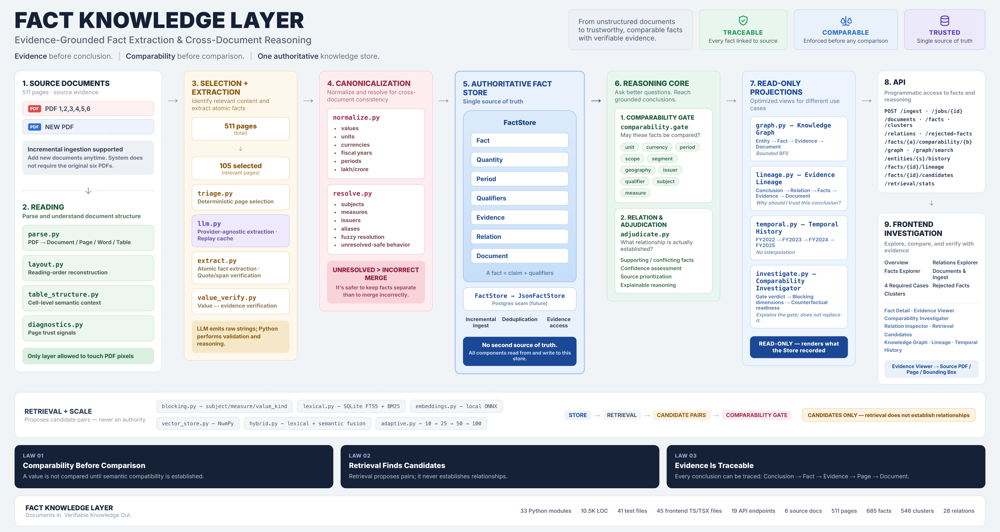
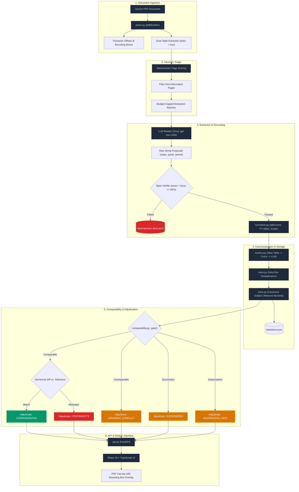
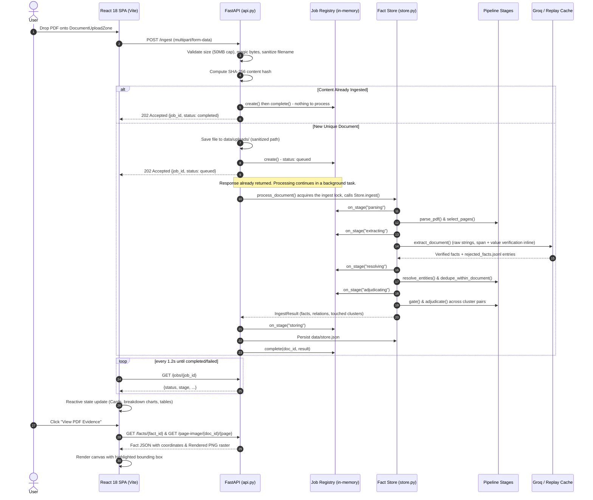
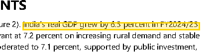
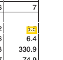
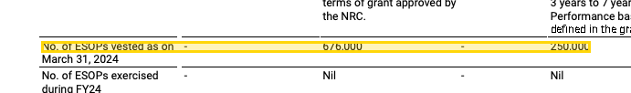
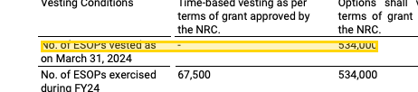
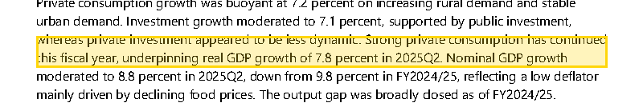
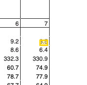

# Fact Layer
### Evidence-Grounded Fact Extraction & Cross-Document Reasoning Engine

[](https://www.python.org/)
[](https://fastapi.tiangolo.com/)
[](https://react.dev/)
[](https://www.typescriptlang.org/)
[](https://vitejs.dev/)
[](https://tailwindcss.com/)
[](#14-developer-submission-checklist)
[](#18-additional-notes)



> **Core Thesis: Comparability Before Comparison**  
> Numerical equality or inequality is meaningless until semantic comparability has been established. Fact Layer refuses to diff values until period, scope, unit, modality, and issuer qualifiers are proven compatible.

**Fact Layer** is an evidence-first knowledge extraction and cross-document reasoning system for unstructured PDF documents. It parses complex filings (corporate prospectuses, annual reports, quarterly earnings, and central bank/macroeconomic reports), extracts structured facts, grounds every accepted fact to verbatim quotes verified against source text with pixel-level PDF coordinates, and adjudicates relational agreements and conflicts using a deterministic comparability gate.

The repository includes:
1. **Python Pipeline Engine (`fact_layer/`)**: A modular 10-stage pipeline with deterministic triage, schema-constrained LLM extraction, mechanical span verification, locale-aware normalization, and multi-tier canonicalization.
2. **FastAPI Service Layer (`api.py`)**: 10 REST endpoints supporting incremental ingestion, querying, and coordinate-mapped PDF rendering.
3. **React + TypeScript Frontend (`frontend/`)**: A modern SPA built with Vite, Tailwind CSS, and Lucide icons, featuring dark/light theming, an interactive PDF evidence viewer with coordinate bounding-box overlays, relation inspection modals, and qualifier diff matrices.
4. **Offline Replay Cache (`cache/llm/`)**: A committed cache enabling 100% offline reproducibility with zero API keys and zero network calls.

---

## Table of Contents

- [1. Why This Exists: The Problem of Naive Comparison](#1-why-this-exists-the-problem-of-naive-comparison)
- [2. System Capabilities: What the System Does](#2-system-capabilities-what-the-system-does)
- [3. Core Design Principles](#3-core-design-principles)
- [4. System Architecture](#4-system-architecture)
  - [4.1 Pipeline Architecture Flowchart](#41-pipeline-architecture-flowchart)
  - [4.2 Ingest Request Lifecycle](#42-ingest-request-lifecycle)
  - [4.3 Ingestion Job Model: Honest Scope](#43-ingestion-job-model-honest-scope)
  - [4.4 Persistence: JSON Today, a Storage Contract for Tomorrow](#44-persistence-json-today-a-storage-contract-for-tomorrow)
- [5. Frontend Architecture & Modern UI Stack](#5-frontend-architecture--modern-ui-stack)
- [6. Pipeline Stages Walkthrough](#6-pipeline-stages-walkthrough)
  - [Stage 1: PDF Parsing (`parse.py`)](#stage-1-pdf-parsing-parsepy)
  - [Stage 2: Deterministic Page Triage (`triage.py`)](#stage-2-deterministic-page-triage-triagepy)
  - [Stage 3: Schema-Constrained Extraction (`extract.py`)](#stage-3-schema-constrained-extraction-extractpy)
  - [Stage 4: Mechanical Span Verification](#stage-4-mechanical-span-verification)
  - [Stage 5: Locale-Aware Normalization (`normalize.py`)](#stage-5-locale-aware-normalization-normalizepy)
  - [Stage 6: Multi-Tier Entity & Measure Resolution (`resolve.py`)](#stage-6-multi-tier-entity--measure-resolution-resolvepy)
  - [Stage 7: Intra-Document Deduplication (`store.py`)](#stage-7-intra-document-deduplication-storepy)
  - [Stage 8: Semantic Clustering (`store.py`)](#stage-8-semantic-clustering-storepy)
  - [Stage 9: The Comparability Gate (`comparability.py`)](#stage-9-the-comparability-gate-comparabilitypy)
  - [Stage 10: Relational Adjudication (`adjudicate.py`)](#stage-10-relational-adjudication-adjudicatepy)
- [7. The Five Relational Verdicts](#7-the-five-relational-verdicts)
- [8. The Four Required Benchmark Cases](#8-the-four-required-benchmark-cases)
  - [Case 1: Corroboration (Cross-Institution Macro Alignment)](#case-1-corroboration-cross-institution-macro-alignment)
  - [Case 2: Contradiction (Intra-Document ESOP Vesting Conflict)](#case-2-contradiction-intra-document-esop-vesting-conflict)
  - [Case 3: Apparent Conflict (Live Forecast Disagreement)](#case-3-apparent-conflict-live-forecast-disagreement)
  - [Case 4: Extraction Failure (Mechanically Logged Rejections)](#case-4-extraction-failure-mechanically-logged-rejections)
- [8a. The Comparability Investigator & Counterfactual Readiness](#8a-the-comparability-investigator--counterfactual-readiness)
- [8b. The Knowledge Graph (a projection, not a database)](#8b-the-knowledge-graph-a-projection-not-a-database)
- [8c. Temporal Knowledge & Evidence Lineage](#8c-temporal-knowledge--evidence-lineage)
- [9. Measured Metrics & Corpus Statistics](#9-measured-metrics--corpus-statistics)
- [10. Empirical Scale & Stress Testing](#10-empirical-scale--stress-testing)
  - [10a. Retrieval + Scale Layer (Candidate Generation Before the Gate)](#10a-retrieval--scale-layer-candidate-generation-before-the-gate)
- [11. Quickstart & Setup Guide](#11-quickstart--setup-guide)
- [12. API Reference](#12-api-reference)
- [13. Honest Limitations & Engineering Post-Mortems](#13-honest-limitations--engineering-post-mortems)
- [14. Developer Submission Checklist](#14-developer-submission-checklist)
- [15. Setup and Run Instructions](#15-setup-and-run-instructions)
- [16. Approach & AI Tools Used](#16-approach--ai-tools-used)
- [17. Limitations and Next Steps](#17-limitations-and-next-steps)
- [18. Additional Notes](#18-additional-notes)

---

## 1. Why This Exists: The Problem of Naive Comparison

Financial reports and macroeconomic surveys constantly restate facts across prospectuses, annual reports, and investor presentations. Reconciling them automatically is a notorious failure mode for naive RAG systems and LLM triple-extractors `(subject, predicate, object)`.

When an automated pipeline compares two values directly:

$$ \text{Revenue}_A = X \quad \text{vs.} \quad \text{Revenue}_B = Y $$

...a simple numerical difference is routinely flagged as a contradiction:

| Fact A | Fact B | Naive Verdict | What Is Actually True | Root Cause |
|---|---|---|---|---|
| Revenue ₹120.4 Cr (FY24) | Revenue ₹32.1 Cr (Q1 FY25) | **Contradiction** | Both figures are correct. | Disjoint time windows (full fiscal year vs. single quarter). |
| Revenue ₹120.4 Cr (Standalone) | Revenue ₹145.9 Cr (Consolidated) | **Contradiction** | Both figures are correct simultaneously. | Accounting boundary divergence (legal entity vs. corporate group). |
| GDP Growth 6.5% (RBI) | GDP Growth 7.8% (IMF) | **Contradiction** | Legitimate institutional disagreement. | Forecasts from two distinct macroeconomic institutions. |
| ₹12,040 (in lakhs) | ₹120.4 Cr | **Contradiction** | Mathematically identical values. | Scale and unit representation differences. |

A bare `(subject, predicate, object)` triple strips away the essential context (**reporting period, scope, scale, currency, modality, and issuer**) needed to determine whether two numbers are comparable.

### The Antidote: A Fact is a Claim Plus Its Qualifiers

In Fact Layer, facts are modeled as rich multi-dimensional records (`fact_layer/models.py`):

```
Fact
├── subject: str               Canonical entity (e.g. "Delhivery Limited")
├── measure: str               Canonical attribute (e.g. "revenue_from_operations")
├── value: Quantity            Canonical numerical value, units, scale, and sig_figs
├── qualifiers: Qualifiers
│   ├── period: Period         Structured fiscal interval (e.g., FY24: 2023-04-01 → 2024-03-31)
│   ├── as_of: date            Point-in-time anchor (for balance sheet/stock figures)
│   ├── scope: Scope           STANDALONE | CONSOLIDATED | SEGMENT
│   ├── basis: Basis           AUDITED | UNAUDITED | PROVISIONAL
│   ├── segment: str           Specific business line or division
│   ├── geography: str         Geographic boundary
│   └── issuer: str            Reporting institution (e.g. "RBI", "IMF", "Delhivery")
├── modality: Modality         ASSERTED | ESTIMATED | PROJECTED | RESTATED
├── evidence: list[Evidence]   Doc ID, page, char span, verbatim quote, verified flag, bbox
└── confidence: float          Deterministic confidence score [0.0, 1.0]
```

---

## 2. System Capabilities: What the System Does

Fact Layer separates mechanical reading from deterministic reasoning:

- **Deterministic PDF Ingestion & Geometry**: Extracts text, tables, character offsets, and pixel-exact bounding boxes (`Page.bbox_for_span()`) using `pdfplumber`.
- **Heuristic Page Triage**: Mathematically scores pages before touching an LLM, reducing 511 corpus pages down to 105 extraction calls (a 5× budget reduction).
- **Schema-Constrained LLM Extraction**: Uses Groq (`openai/gpt-oss-120b`) purely as a text reader. The model extracts raw strings; it is never permitted to calculate, convert, or infer numbers.
- **Strict Anti-Hallucination Span Verification**: Every extracted quote is mechanically verified against raw source text using exact and fuzzy ($\ge 92\%$) matching. Unverified quotes are permanently rejected and logged.
- **Locale-Specific Normalization**: Deterministic Python converts Indian numbering systems (lakhs, crores), Indian fiscal years (April-March), and accounting scopes without model uncertainty.
- **Multi-Tier Canonicalization**: Maps non-standardized strings into shared canonical keys through deterministic rules, declarative alias tables, fuzzy scoring, and a capped LLM fallback.
- **Deterministic Comparability Gate**: An 8-step skeptic engine checks period, scope, unit, and issuer compatibility *prior* to numerical evaluation.
- **Contextual Conflict Explanations**: Differentiates between true mathematical contradictions and expected forecast variances, generating plain-English audit trails.
- **Incremental Ingestion**: Uploading a PDF updates only affected clusters without recomputing unrelated document relations.
- **Interactive Evidence Provenance UI**: A modern React SPA with PDF canvas rendering, bounding-box overlays, zoom controls, and theme switching.
- **Evidence-Grounded Knowledge Graph** (`fact_layer/graph.py`): a bounded, read-only projection connecting resolved entities, facts, evidence spans, source documents and established relationships, so a full provenance chain (entity → fact → evidence → document → page) can be traced by clicking. It has no database of its own and infers nothing. See [§8b](#8b-the-knowledge-graph-a-projection-not-a-database).
- **Comparability Investigator & Counterfactual Readiness** (`fact_layer/investigate.py`): a deterministic, evidence-linked explanation of why any two facts do or do not satisfy the comparability gate (every blocking dimension, not just the first) plus a structured statement of what would need to be true before a valid comparison could be made. It never modifies a fact. See [§8a](#8a-the-comparability-investigator--counterfactual-readiness).
- **Retrieval + Scale Layer** (`fact_layer/retrieval/`, optional, `RETRIEVAL_ENABLED=false` by default): deterministic candidate blocking, hybrid lexical (BM25/FTS5) + semantic (local embedding) retrieval, and a local vector store narrow which fact pairs are even considered before they reach the unmodified comparability gate: see [§10a](#10a-retrieval--scale-layer-candidate-generation-before-the-gate).
- **Temporal Knowledge & Evidence Lineage** (`fact_layer/temporal.py`, `fact_layer/lineage.py`): a chronologically-ordered, scope/modality-grouped fact history per entity+measure that is never interpolated and never invents a relationship, plus a provenance-chain trace (conclusion → fact(s) → evidence → page → document) built entirely on the existing Knowledge Graph projection. See [§8c](#8c-temporal-knowledge--evidence-lineage).

---

## 3. Core Design Principles

### Principle 1: Evidence First
A claim without verifiable evidence is considered non-existent. Every accepted fact contains a verbatim quote pinned to a document ID, page number, and character span. If an LLM paraphrases a table into fluent text that cannot be verified against contiguous page bytes, the fact is rejected and written to `data/rejected_facts.jsonl`.

### Principle 2: Comparability Before Comparison
The system refuses to compute $\Delta = |V_1 - V_2|$ until the comparability gate has exhausted all potential qualifier mismatches. The gate acts as a skeptic; the adjudicator acts only after the gate finds no structural objection.

### Principle 3: The Model Reads; Python Reasons
Language models struggle with reliable arithmetic across currency scales and fiscal calendars. In Fact Layer:
- **LLM**: Emits raw strings (`"120.4 crore"`, `"FY2023-24"`, `"standalone"`).
- **Python**: Parses strings into typed `Quantity` and `Period` objects, converts units, checks date overlaps, and evaluates equality.

### Principle 4: Explicit Uncertainty
When documents omit qualifiers (e.g., omitting reporting periods in statistical annexes), Fact Layer penalizes confidence scores (e.g., halving confidence on contradictions to 0.475) and attaches explicit audit flags (`_period_unverified`) rather than guessing missing metadata.

---

## 4. System Architecture

### 4.1 Pipeline Architecture Flowchart



### 4.2 Ingest Request Lifecycle

`POST /ingest` returns as soon as the upload is validated and safely stored: it never blocks on the pipeline itself (a full extraction pass can take minutes). The actual processing runs as a background task; the client polls `GET /jobs/{job_id}` for stage/status until it reaches `completed` or `failed`.



### 4.3 Ingestion Job Model: Honest Scope

`fact_layer/jobs.py`'s `JobStore` is an **in-memory, single-process, best-effort** registry: deliberately not Celery/Redis/RabbitMQ/Kafka, which this assignment's scale and "locally runnable, easy to demo" goal don't warrant. What that choice actually means:

- **Stages are real, not fabricated.** `QUEUED → PARSING → EXTRACTING → RESOLVING → ADJUDICATING → STORING → COMPLETED` map to actual boundaries inside `Store.ingest()` (via an additive, optional `on_stage` callback) and `api.py`'s persistence step. There is deliberately **no separate "verifying" stage**: span verification and deterministic value verification happen fact-by-fact, inline inside `EXTRACTING`, as each raw candidate is produced: not as a discrete pass afterward. Reporting a stage transition for a boundary that doesn't exist would be exactly the fake-progress this project's diagnostics elsewhere refuse to manufacture. There is no percentage anywhere in this model.
- **A restart loses job records, not ingested data.** A job's own bookkeeping (its `job_id`, timestamps, in-flight stage) lives only in process memory: restarting `uvicorn` clears every job, in-flight or completed. This does **not** lose any fact/relation/document: by the time a job reaches `COMPLETED`, its output was already written to `data/store.json`, which is what `api.py` reloads on the next startup. Only the "job" as a UI-facing progress ticket is ephemeral, not the pipeline's actual output.
- **Concurrency is handled by serialization, not parallelism.** `Store` is one shared, JSON-persisted Python object; a single `threading.Lock` (`api._INGEST_LOCK`) is held for the whole of `process_document()`, so two uploads landing close together process **one at a time**, never interleaved. This is correct and simple, but it is not a throughput feature: a second upload's job sits in `QUEUED`/`PROCESSING` until the first's lock is released, exactly like it would with a single-worker queue. Verified in `tests/test_jobs.py::test_ingest_lock_serializes_concurrent_processing`, which proves two concurrent background tasks never overlap their critical sections.
- **What would change for multi-instance deployment:** the `JobStore` would need to move to a shared backend (Redis, a database table) so every instance's `GET /jobs/{id}` sees the same state, and the `_INGEST_LOCK` would need to become a distributed lock (or the JSON-backed `Store` would need to become a real database) so concurrent instances don't race on `data/store.json`. None of that exists today: this is a single-process, single-instance design, stated plainly rather than described as more than it is.

### 4.4 Persistence: JSON Today, a Storage Contract for Tomorrow

**Current: `data/store.json` via `JsonFactStore`.** This is a local assignment, run by one grader on one machine, with no concurrent users and a corpus of a handful of PDFs (a single JSON file is simple, fully reproducible (`scripts/build_demo_store.py` rebuilds it deterministically), needs zero external services or credentials, and every existing consumer already round-trips through it correctly (566 tests, including a byte-for-byte real-corpus regression check). **This is not pretended to be horizontally scalable**) see "What this does not provide" below.

**The point of this section: persistence is isolated behind a contract, not scattered through the domain.** `fact_layer/storage.py` defines:

```
              FactStore (abstract: load, save, list_rejected_facts, read_resolution_summary)
                 │
      ┌──────────┴──────────┐
      │                      │
JsonFactStore          PostgresFactStore
   (data/*.json,           (skeleton only - see its class
    THIS repo's default)    docstring for what's missing)
```

- `StoreSnapshot` is the whole persisted fact/relation/document graph as one value (facts, extra_evidence, relations, clusters, ingested_docs) (mirroring exactly what `Store.save()`/`Store.load()` always serialized, because that IS the real write pattern here: `Store` mutates its in-memory dicts incrementally across many `ingest()` calls and flushes one snapshot at a time. The contract's `load()`/`save()` operate on that whole snapshot rather than exposing `save_fact()`/`save_relation()` per-entity methods nothing in this pipeline would ever call one at a time) this is a deliberate, smaller-than-suggested interface, chosen from actual behavior rather than a generic repository template.
- `list_rejected_facts()` and `read_resolution_summary()` exist because `api.py`'s `/stats` and `/rejected-facts` endpoints used to `open("data/rejected_facts.jsonl")`/`open("data/resolution_log.json")` directly: that was the literal "core domain contains `open(...)`/`json.load(...)`" problem. Both endpoints now go through `STORE.backend` instead.
- `Store.save(path)` / `Store.load(path)` keep their exact pre-refactor signatures and default paths (`path: str`, defaulting to `data/store.json`) so every existing caller and test is unaffected: but `path` may now also be a `FactStore` instance directly (`Store.load(my_postgres_backend)`), which is the actual seam a future backend plugs into.
- `Store.backend` is the `FactStore` a `Store` was loaded from (or a fresh `JsonFactStore()` by default): this is what `api.py`'s diagnostic reads use.

**Two things were deliberately left outside this contract:**
- `extract.py`'s real-time rejected-fact append (`_append_rejected`, one `open(path, "a")` call per rejected candidate, inline inside extraction) is untouched: it already takes an injectable `path` parameter, which is what tests use to redirect it away from the real deliverable file. Routing a single-line append through a `FactStore` method would add indirection to the extraction hot path for no behavior change; only the aggregate *read* side (api.py assembling the file back into JSON) was unified.
- `resolve.py`'s `write_resolution_log()` builds its summary dict FROM live `Resolver` state (decision tiers, LLM call counts): that computation is domain logic, not persistence, so it stays put. Only reading the result back goes through `FactStore.read_resolution_summary()`.

**Configuration:** `STORAGE_BACKEND` (default `json`) selects the backend `api.py`'s `STORE` singleton constructs: see `fact_layer/storage.py::backend_from_env()`. No cloud credentials are needed for local development; `STORAGE_BACKEND=postgres` is accepted as a value (the seam is real) but raises `NotImplementedError` immediately rather than silently pretending to talk to a database that was never connected.

**What a real `PostgresFactStore` would still need** (documented in its class docstring, not built (nothing here justifies the added operational complexity for a local assignment): a `facts`/`relations`/`documents`/`rejected_facts`/`resolution_log` table mirroring `StoreSnapshot`'s fields, `save()` becoming one transaction instead of one `os.replace()`, and a connection pool. That last point is the actual motivating reason to ever make this move for real) see the transactional gap below.

**What this does not provide (documented, not faked):**
- *Transactions.* `JsonFactStore.save()` is atomic at the **file** level (temp file + `os.replace()`, the same pattern this codebase already uses for the LLM replay cache and the parsed-PDF cache) (a save either fully lands or the previous file is untouched, there is no half-written `store.json`. But there is no multi-table transaction underneath it: "the new facts from this ingest AND the relations they produced land together, or neither does" is not a guarantee a single `open()`/`json.dump()` call can express beyond "the one file that holds all of it was replaced atomically." In practice this hasn't caused a real bug (an ingest failure raises before `Store.save()` is ever called) see `process_document()`), but a true database backend would express it as a real `BEGIN`/`COMMIT` instead of relying on "it's all one file."
- *Multi-writer concurrency.* Two processes writing `data/store.json` at once is not something JSON-plus-`os.replace()` arbitrates (the last writer wins, in full, with no merge and no conflict error. This repo does not need that: `api.py`'s `_INGEST_LOCK` (a single `threading.Lock`, see §4.3) already serializes every ingest inside the one process that owns the file, which is the actual concurrency risk that exists today (two uploads racing on `Store.facts`/`Store.clusters` within the same running server). It is a real, tested fix for a real, in-process race (`tests/test_jobs.py::test_ingest_lock_serializes_concurrent_processing`)) not a substitute for a database's row-level locking, which is what a genuinely multi-writer deployment (multiple `uvicorn` instances, or manual edits alongside a running server) would need instead. Turning JSON into something that pretends to arbitrate cross-process writes was deliberately not attempted here.

---

## 5. Frontend Architecture & Modern UI Stack

The frontend is a dedicated React 18 application built with TypeScript, Vite, and Tailwind CSS. It replaced the original prototype while preserving backend API contracts.

```
frontend/
├── src/
│   ├── components/
│   │   ├── cases/               # 4 Required benchmark case studies
│   │   │   └── RequiredCasesPage.tsx
│   │   ├── clusters/            # Fact clusters grouped by subject::measure
│   │   │   └── ClustersPage.tsx
│   │   ├── common/              # Reusable design primitives
│   │   │   ├── AboutModal.tsx       # System thesis & architecture reference
│   │   │   ├── ConfidencePill.tsx   # Color-coded confidence badges
│   │   │   ├── EmptyState.tsx       # Standard empty data states
│   │   │   ├── LoadingSkeleton.tsx  # Pulse skeleton loaders
│   │   │   ├── Modal.tsx            # Accessible modal container with backdrop blur
│   │   │   └── ThemeToggle.tsx      # Sun/Moon light & dark theme switch
│   │   ├── documents/           # Document inventory & upload
│   │   │   ├── DocumentsPage.tsx
│   │   │   └── DocumentUploadZone.tsx # Drag & drop zone with progress animation
│   │   ├── evidence/            # Pixel-accurate evidence grounding
│   │   │   ├── EvidenceModal.tsx    # Evidence anchor modal & verbatim quote viewer
│   │   │   └── PdfPageCanvas.tsx    # Interactive canvas, zoom toolbar & bbox overlay
│   │   ├── facts/               # Fact exploration
│   │   │   ├── FactDetailDrawer.tsx # Slide-out inspector with qualifier breakdown
│   │   │   └── FactsPage.tsx        # Filterable facts inventory
│   │   ├── layout/              # Responsive shell
│   │   │   ├── AppShell.tsx         # Main layout container & mobile navigation
│   │   │   ├── Sidebar.tsx          # Desktop navigation & platform status
│   │   │   └── TopBar.tsx           # Health ping, stats pills & relation chips
│   │   ├── overview/            # Operational dashboard
│   │   │   └── OverviewPage.tsx     # KPIs, distribution bars & recent relations
│   │   └── relations/           # Comparability gate & adjudication
│   │       ├── GateVerdictBadge.tsx     # Standardized verdict tags
│   │       ├── QualifierDiffTable.tsx   # Side-by-side qualifier alignment table
│   │       ├── RelationInspectorModal.tsx # Full-context relation inspector
│   │       └── RelationsPage.tsx        # Filterable cross-fact relations matrix
│   ├── context/
│   │   └── ThemeContext.tsx     # Light/Dark mode state engine with OS sync
│   ├── lib/
│   │   ├── api.ts               # Typed fetch client for all 10 FastAPI routes
│   │   ├── constants.ts         # Verdict color configs & reason code caveats
│   │   └── utils.ts             # Tailwind merge & formatting helpers
│   ├── types/
│   │   └── index.ts             # Strict TypeScript domain interfaces
│   ├── App.tsx                  # Root application router
│   ├── main.tsx                 # React entry point
│   └── index.css                # Tailwind utility definitions & custom theme tokens
├── package.json
├── vite.config.ts               # Vite bundler configuration & /api reverse proxy
├── tsconfig.json                # TypeScript compiler configuration
└── tailwind.config.js           # Theme extensions, palettes, and typography
```

### Dual-Mode Hosting & Serving
1. **Production Mode (Zero-Config)**: The React app is compiled to static assets (`frontend/dist/`). FastAPI mounts these assets directly at `/` via `StaticFiles(html=True)`. Graders run `uvicorn api:app` and access the production application immediately.
2. **Development Mode (HMR)**: Running `npm run dev` in `frontend/` launches Vite on `http://localhost:5173` with Hot Module Replacement (HMR) and an internal proxy routing backend requests to port 8008.

### Evidence-First Presentation
A reviewer opening a fact moves through the same hierarchy the backend actually computes, never a flattened summary: **fact → value → verification → source context → source evidence → comparability/relationship.** Concretely: `FactDetailDrawer` shows the canonical value and its qualifiers; `EvidenceModal` shows exactly the verification badges the backend state supports (`Span Verified` always, `Value Verified` for `verified`/`verified_with_context`, and an additional `Context Verified` badge *only* for `verified_with_context` (never shown speculatively)) followed by a Source Context box (row/column/unit, each line shown only when that field is actually populated) and the PDF page image with the evidence bbox highlighted; when a value was attributed to a specific table cell, a second, distinctly-colored overlay (`TARGET CELL`) is drawn from the real stored `cell_bbox` (never a synthesized region. An `unverified` fact gets a plain-language explanation drawn from the real `value_verification_reason` (e.g. "Multiple numeric candidates exist in the cited source region... No value was guessed.") rather than a bare warning icon. `RelationInspectorModal` extends the same chain one level further: the relation's own `reason_code`, a human explanation mapped from the real backend vocabulary (`getCaveatExplanation`) see Honest Limitations #10 for a real bug this replaced), and (when the comparability gate's raw verdict differs from how adjudication classified the relationship (e.g. gate says `INCOMPARABLE_ISSUER`, relation type is `CORROBORATES`)) that distinction is shown explicitly rather than hidden behind the friendlier label.

---

## 6. Pipeline Stages Walkthrough

### Stage 1: PDF Parsing (`parse.py`)
Uses `pdfplumber` to extract plain text and structural geometry:
- **Character Offsets**: Pointers map every character in extracted strings back to coordinate bounding boxes $[x_0, \text{top}, x_1, \text{bottom}]$ on the rendered page canvas.
- **Dual Table Extraction**: Real filings mix borderless statistical tables with bordered financial statements. The parser first attempts a line-based strategy (`intersection_x_tolerance=3`). If extracted table density is abnormally low (as in IMF statistical annexes), it falls back to a text-clustering strategy (`snap_tolerance=3`), recovering tables that would otherwise be missed.
- **Parsing diagnostics (`diagnostics.py`)**: computed entirely from already-parsed `Page`/`Document` objects, no re-parsing. `PageDiagnostics` reports word/text/table counts and per-page warnings (e.g. sparse text); `DocumentDiagnostics` aggregates those and adds conservative repeated-header/footer detection (a top/bottom line recurring, after whitespace/case/digit-run normalization, across at least 30% of a document's text pages, minimum 3) (the digit-run collapse is what lets a paginated footer like "Page 47" / "Page 48" register as one recurring pattern rather than 100 different lines. A page's existing `image_only` flag (parse.py, unchanged: zero extractable text) is never conflated with the new, separate "sparse" warning (nonzero but low word count)) a warning is visibility, not a rejection; `extract.py`'s accept/reject decisions never read this module.

#### Deterministic Document Structure Layer (`layout.py`, `table_structure.py`)

Two further additive modules sit between parsing and extraction, both pure functions of the already-parsed `Page`/`Table` objects (no PDF re-reads, no LLM calls, and neither ever changes `Page.text`, `Word` offsets, or `Table.to_text_block()` (the string hashed into the LLM replay-cache key, deliberately left untouched) see the Honest Limitations entry on why a richer, cache-breaking prompt format was tried and reverted).

- **Layout reconstruction (`layout.py`)** groups words into lines, lines into blocks (`paragraph` / `heading` / `table_adjacent` / `list` / `unknown` ("unknown" is an accepted, honest outcome, not a bug), and only ever flags a page as multi-column when **several independent spatial signals agree**: a wide word gap, present on a clear majority of multi-word lines, recurring at a stable x-position across them, with table-overlapping and table-of-contents-style dot-leader lines excluded first. This bar was set empirically: a naive "one wide gap = two columns" rule was measured against the real corpus and found to fire on 25.9% of long lines (4,902/18,902)) almost entirely table-adjacent prose, not real column layout. The stricter, multi-signal rule brings that down to a single page across the whole 511-page corpus (a financial-statement table pdfplumber's lattice/text strategies didn't catch as a `Table`), and (crucially) is a **diagnostic flag only**: no page's actual reading order is ever changed by it, so even that one residual false positive has zero effect on evidence.
- **Semantic table structure (`table_structure.py`)** turns a `Table`'s flat `rows`/`cell_bboxes` into a cell-level `StructuredTable`: column headers (with narrow, evidence-gated support for genuine two-level headers (e.g. `"2024"` spanning `"Actual"`/`"Forecast"` sub-columns), row labels, table-local units, and per-column period recognition (via `normalize.parse_period()`, never a bespoke rule). Ambiguity is explicit and load-bearing, not a fallback: a cell is marked ambiguous when it itself packs more than one numeric candidate (the real ESOPs-row shape) `"676,000 - 250,000"` in one cell) or when the table's first column is itself numeric (so treating it as a row label would misattribute every value in the row): `find_cells_matching_value()` then excludes ambiguous cells entirely rather than guessing among them.

### Stage 2: Deterministic Page Triage (`triage.py`)
Processing every page of a 511-page corpus through an LLM is cost-prohibitive. Fact Layer scores each page using the domain-specific information density formula:

$$ \text{Score} = N_{\text{periods}} \times \ln(N_{\text{quantities}} + 1) \times S_{\text{currency}} $$

Where:
- $N_{\text{periods}}$: Count of detected calendar/fiscal periods.
- $N_{\text{quantities}}$: Count of valid numerical figures (filtered to exclude standalone calendar years like `"1990"` or `"2025"`).
- $S_{\text{currency}}$: Boost multiplier ($1.5\times$) if scale markers like `"in lakhs"` or `"in crores"` are present.

Pages scoring below the adaptive threshold are skipped, reducing calls from 511 to 105.

### Stage 3: Schema-Constrained Extraction (`extract.py`)
Selected pages are batched into prompt payloads. To prevent context drift:
1. **Document-Wide Reporting Defaults**: A preliminary call extracts document-level defaults (issuer, reporting currency, scale, accounting scope).
2. **Raw-String Constraints**: The LLM prompt enforces JSON Schema validation and strictly forbids calculations. The model extracts verbatim strings:
   ```json
   {
     "subject_raw": "Delhivery Limited",
     "measure_raw": "Revenue from operations",
     "value_raw": "120.4 crore",
     "period_raw": "FY24",
     "verbatim_quote": "Revenue from operations reached ₹120.4 crore in FY24"
   }
   ```

### Stage 4: Mechanical Span Verification
Before entering the store, the proposed `verbatim_quote` is tested against raw page text:
1. Normalizes whitespace across both candidate quote and source page.
2. Checks for exact substring containment.
3. If not exact, performs a fuzzy character-level match. If similarity is $\ge 92\%$, the quote is snapped to real source coordinates.
4. If similarity is $< 92\%$, the fact is **rejected** and logged to `data/rejected_facts.jsonl`.

**This proves the quote exists in the source PDF. It does not prove `value_raw` (a separate field in the same LLM response) is the number that quote actually states.** An LLM can quote real text verbatim while misreporting the figure beside it (wrong column, wrong row, a transposed digit). `fact_layer/value_verify.py` closes that specific gap immediately after span verification, with pure deterministic Python: no second LLM call:

1. Re-derives every distinct numeric quantity the verified quote text can support, using the *same* `normalize.parse_quantity()` value_raw itself was parsed with (never a second numeric parser), with date/FY phrases masked out first via `normalize.parse_period()` so `"FY2024"` never gets mistaken for a value candidate.
2. If the quote supports **exactly one** distinct number and it agrees with `value_raw`'s parsed value within the figure's own stated precision (`Quantity.tolerance()`), the fact is `value_verification: "verified"`.
3. If the quote supports **zero or several** distinct candidate numbers (a bare row of table figures with no column/position signal to pick from is the real, observed case (`"No. of ESOPs vested as on - 676,000 - 250,000"`)) the fact is `value_verification: "unverified"`. This is a deliberate refusal to guess, not a failure: the same principle Stage 9 applies between two facts (never compare before establishing what's being compared) applied here between one fact and its own evidence.
4. If exactly one number is supported, currency/percent category matches on both sides, and the magnitude still disagrees beyond tolerance, the fact is **rejected** at extraction time (reason `value_mismatch`, logged to `data/rejected_facts.jsonl`): a hallucinated value never reaches the store. A currency/unit disagreement is never silently reconciled (no FX conversion, same rule as the comparability gate); it is left `unverified` rather than guessed.
5. Non-numeric (text/entity) facts have no deterministic numeric check to run and are always `unverified`: never falsely marked `verified` by numeric logic.

`value_verification` and `value_verification_reason` are additive fields on `Fact` (excluded from `compute_id()`: see Stage 8 note below) and are surfaced on `GET /facts` and `GET /facts/{id}` for the frontend's evidence panel to display alongside span-verification status.

**Context-aware upgrade (`verified_with_context`).** When a fact's evidence bbox falls inside exactly one table on its page, `table_structure.locate_cell()` looks for exactly one non-ambiguous cell in that table whose own text agrees with `value_raw`. If found, that cell's row label, column header, and unit are attached to the fact's `Evidence` (A8: `row_label`, `column_header`, `unit_context`, `table_id`, `row_index`, `column_index`, `cell_bbox` (all `None`/empty when attribution isn't confident, never guessed)) the frontend's evidence panel shows these as "Source Context" alongside the highlighted quote. This can only ever **upgrade** an already-`verified` result to `verified_with_context`; a defensive re-check inside `verify_value()` independently re-derives the cell's own value (under the cell's own unit, not reused from `effective_context`, to avoid a false disagreement between two correctly-scaled-differently numbers) before trusting it, so a mismatched or stale `cell_context` can never attach a fabricated row/column label. It never resolves an ambiguity the quote-level check alone could not: the ESOPs-style multi-number case stays `unverified` regardless of table structure, because `find_cells_matching_value()` excludes ambiguous cells before a `cell_context` is ever built.

### Stage 5: Locale-Aware Normalization (`normalize.py`)
Converts raw strings into structured dataclasses using deterministic Python:
- **Numerical Scales**: Recognizes Indian and Western scales (`lakh` $= 10^5$, `crore` $= 10^7$, `million` $= 10^6$, `billion` $= 10^9$).
- **Precision Tolerance**: Parses significant figures. A stated value of `"₹120.4 Cr"` carries an implicit tolerance of $\pm 0.05\text{ Cr}$, preventing false contradictions against exact unrounded values like `"₹1,20,41,23,456"`.
- **Fiscal Calendar Windows**: Converts `"FY24"` or `"FY2023-24"` into explicit dates: `2023-04-01` to `2024-03-31`. Correctly handles quarterly offsets where Q1 FY25 represents April-June 2024.

### Stage 6: Multi-Tier Entity & Measure Resolution (`resolve.py`)

**Measures** get the full tiered treatment: (1) deterministic normalization, (2) a declarative `MEASURE_ALIASES` table (e.g. `"Revenue from operations"` → `revenue`), (3) fuzzy `SequenceMatcher` clustering for near-misses (typos, minor rephrasing) above an 0.85 ratio threshold, (4) a capped, cached LLM call for the residual ambiguous tail (≤60 calls/run): never the sole authority, only asked about a pair the deterministic/fuzzy tiers already narrowed down.

**Subjects (entities) deliberately do NOT get the same tiers**: this is a precision-first asymmetry, not an oversight. A subject participates in `Fact.cluster_key()` (`subject::measure`); a false subject merge silently feeds two unrelated claims into comparability/adjudication and manufactures a false relationship, so subject resolution only implements the two SAFE tiers:
1. **Deterministic normalization** (`normalize_entity()`): case/punctuation, honorific stripping (`"Mr. Deepak Kapoor"` → `"Deepak Kapoor"`), company-suffix stripping (`"Delhivery Limited"` == `"Delhivery Corp Limited"`).
2. **A small, curated `SUBJECT_ALIASES` table** (institution abbreviations (RBI, IMF, GoI) and unambiguous whole-economy phrasings (`"Indian economy"`, `"India's economy"` → `india`). Every entry is a human-vetted, unconditional identity; sub-scoped phrases (`"India's banking sector"`, `"Indian firms"`) both real subjects in this corpus) are deliberately absent.

**Fuzzy and LLM tiers for subjects were evaluated and rejected** (see §13's "Entity Resolution: Why Subjects Don't Get a Fuzzy Tier" for the real-corpus evidence (this corpus's RBI tables contain `'Reserve Money (RM)'`, `'Reserve money (RM) growth'`, and `'Reserve money (RM) share of GDP'` as three genuinely distinct subjects, where the first is a strict prefix of the other two) proof that a prefix/ratio fuzzy tier would actively cause false merges here, not just fail to help). When subject evidence is ambiguous, the system stays fragmented (recall loss) rather than guesses (precision loss): "prefer UNRESOLVED over INCORRECT MERGE."

### Stage 7: Intra-Document Deduplication (`store.py`)
When the same fact appears multiple times across a single document (e.g., in an executive summary and in detailed financial notes), Fact Layer collapses them into a single canonical fact with multiple evidence anchors. Agreement within the same document is weighted to zero to avoid artificial self-corroboration.

### Stage 8: Semantic Clustering (`store.py`)
Facts sharing identical canonical keys (`subject::measure`) are grouped into clusters. Cross-document comparison runs exclusively across facts within the same cluster.

### Stage 9: The Comparability Gate (`comparability.py`)
The gate evaluates qualifier alignment in strict order:
1. **Value Kind**: Non-numeric text cannot be compared to quantities $\to$ `INCOMPARABLE_KIND`.
2. **Accounting Scope**: Standalone vs. Consolidated $\to$ `INCOMPARABLE_SCOPE`.
3. **Business Segment**: Different operational segments $\to$ `INCOMPARABLE_SEGMENT`.
4. **Unit & Currency**: INR vs. USD $\to$ `INCOMPARABLE_UNIT`. *The system refuses to apply third-party FX conversions unless explicitly stated in the source document.*
5. **Issuer & Modality**: Different issuers where at least one figure is projected $\to$ `INCOMPARABLE_ISSUER` (reason: `forecast_disagreement`). *Note: If both figures are ASSERTED historical facts, comparison proceeds.*
6. **Temporal Period**:
   - Equal $\to$ Proceed to compare values.
   - Disjoint (FY24 vs. FY25) $\to$ `INCOMPARABLE_PERIOD`.
   - Subsumed (Quarter inside Fiscal Year) $\to$ `AGGREGATION_CANDIDATE`.
   - Sequential point-in-time facts $\to$ `TEMPORAL_SUCCESSION`.
7. **Audit Basis**: Audited vs. Unaudited variances $\to$ Marked as provisional revisions.
8. **Passed Gate**: If all checks pass $\to$ `COMPARABLE`.

### Stage 10: Relational Adjudication (`adjudicate.py`)
Transforms gate results into final typed relations with explicit rationale strings and confidence scores.

---

## 7. The Five Relational Verdicts

| Verdict | Gate Status | Value Relationship | Confidence Range | Semantic Definition |
|---|---|---|---|---|
| `CORROBORATES` | `COMPARABLE` | Values match within tolerance | `0.60` - `0.95` | Two independent sources state compatible values under matching qualifiers. *(Also applies if values match exactly despite minor issuer forecast differences).* |
| `CONTRADICTS` | `COMPARABLE` | Values disagree beyond tolerance | `0.45` - `0.85` | Sources share matching scope and periods, but state mutually exclusive numbers with no qualifier explaining the gap. *(Penalized if periods are unverified).* |
| `APPARENT_CONFLICT` | `INCOMPARABLE_*` | Values differ | `0.75` - `0.90` | Values disagree on the surface, but the comparability gate identifies a legitimate qualifier variance (period mismatch, scope divergence, or forecast variance). |
| `SUPERSEDES` | `TEMPORAL_SUCCESSION` | Point-in-time update | `0.80` - `0.90` | A sequential point-in-time statement updates or replaces an earlier status (e.g., an executive appointment or interim balance sheet revision). |
| `AGGREGATES_INTO` | `AGGREGATION_CANDIDATE` | Component vs. Composite | `0.75` - `0.85` | A metric representing a sub-period (e.g., Q1) contributes hierarchically to a composite multi-period total (e.g., FY24). |

---

## 8. The Four Required Benchmark Cases

These four cases demonstrate the end-to-end pipeline operating across real filings from the corpus.

### Case 1: Corroboration (Cross-Institution Macro Alignment)
- **Source Fact A**: IMF Article IV Report (`03-imf-india-2025-article-iv-excerpt.pdf`, p.10)  
  *Quote*: `"India's real GDP grew by 6.5 percent in FY2024/25."*  
  *Normalized Value*: `6.5%` | *Issuer*: `IMF` | *Modality*: `ASSERTED`
- **Source Fact B**: RBI Annual Report (`02-rbi-annual-report-2024-25-excerpt.pdf`, p.91)  
  *Quote*: `"6.5"` (Statistical Annex, Real GDP at Market Prices row)  
  *Normalized Value*: `6.5%` | *Issuer*: `RBI` | *Modality*: `ASSERTED`
- **Gate Evaluation**: `INCOMPARABLE_ISSUER` (different institutions).
- **Adjudication Verdict**: `CORROBORATES` (Confidence: `0.60`).
- **Reason Code**: `value_match_despite_forecast_disagreement`.
- **System Rationale**: *"Values match, though context differs: IMF and RBI project different values for the same period; this is forecast disagreement between institutions, not a factual error."*

<p align="center">
  
  
</p>

---

### Case 2: Contradiction (Intra-Document ESOP Vesting Conflict)
- **Source Fact A**: Delhivery Annual Report FY24 (`02-delhivery-annual-report-fy24-excerpt.pdf`, p.43)  
  *Quote*: `"No. of ESOPs vested as on - 676,000 - 250,000"`  
  *Normalized Value*: `426,000` (Calculated net: $676,000 - 250,000$) | *Period*: `as on March 31, 2024`
- **Source Fact B**: Delhivery Annual Report FY24 (`02-delhivery-annual-report-fy24-excerpt.pdf`, p.44)  
  *Quote*: `"No. of ESOPs vested as - 534,000"`  
  *Normalized Value*: `534,000` | *Period*: *None stated*
- **Gate Evaluation**: `COMPARABLE`.
- **Adjudication Verdict**: `CONTRADICTS` (Confidence: `0.475`).
- **Reason Code**: `value_mismatch_period_unverified`.
- **System Rationale**: *"Same subject, measure, scope and period, but the values differ by 21.0% (676,000 - 250,000 vs 534,000). No contextual qualifier accounts for the gap. One source states no reporting period, so a like-for-like comparison cannot be confirmed; this may reflect an extraction gap rather than a real disagreement."*
- **Confidence Penalty**: The system explicitly halves confidence ($0.95 \to 0.475$) because Fact B lacked a stated reporting period.

<p align="center">
  
  
</p>

---

### Case 3: Apparent Conflict (Live Forecast Disagreement)
- **Source Fact A**: IMF Article IV Report (`03-imf-india-2025-article-iv-excerpt.pdf`, p.10)  
  *Quote*: `"Strong private consumption has continued this fiscal year, underpinning real GDP growth of 7.8 percent in 2025Q2."*  
  *Normalized Value*: `7.8%` | *Issuer*: `IMF` | *Modality*: `PROJECTED`
- **Source Fact B**: RBI Annual Report (`02-rbi-annual-report-2024-25-excerpt.pdf`, p.91)  
  *Quote*: `"6.5"`  
  *Normalized Value*: `6.5%` | *Issuer*: `RBI` | *Modality*: `PROJECTED`
- **Gate Evaluation**: `INCOMPARABLE_ISSUER`.
- **Adjudication Verdict**: `APPARENT_CONFLICT` (Confidence: `0.85`).
- **Reason Code**: `forecast_disagreement`.
- **System Rationale**: *"The figures differ, but this is explained by context rather than error: IMF and RBI project different values for the same period; this is forecast disagreement between institutions, not a factual error."*
- **Interactive Live Ingest**: In the pre-seeded 5-document demo store, this relation does not exist. Uploading `03-imf-india-2025-article-iv-excerpt.pdf` live forms this relation dynamically in 74 seconds.

<p align="center">
  
  
</p>

---

### Case 4: Extraction Failure (Mechanically Logged Rejections)
Out of the fact candidates proposed across the corpus, **95 were rejected** by mechanical span verification and logged directly to `data/rejected_facts.jsonl` (82 `quote_not_found`, 13 `no_measure`). This file is rebuilt by the five-document demo build, so it covers the five pre-seeded documents; the held-back IMF document appends its own rejections when it is ingested live:

#### Rejection Example A: Ungrounded Quote Paraphrase (`quote_not_found`)
```json
{
  "raw_fact": {
    "subject_raw": "Offer for Sale",
    "value_raw": "82,152,503",
    "verbatim_quote": "Offer for Sale 82,152,503* Equity Shares aggregating to ₹40,000.00 million"
  },
  "doc_filename": "01-delhivery-prospectus-2022-excerpt.pdf",
  "page_no": 1,
  "reason": "quote_not_found",
  "detail": "Best fuzzy ratio 0.88 below threshold 0.92 across candidate page text."
}
```
*Diagnosis*: The LLM omitted a reflowed footnote marker (`*`) and concatenated adjacent text cells into a clean sentence. Because the contiguous character sequence did not exist on the PDF canvas, the fact was rejected.

#### Rejection Example B: Missing Attribute Name (`no_measure`)
```json
{
  "raw_fact": {
    "subject_raw": "PIN code reach",
    "measure_raw": null,
    "value_raw": "12,764",
    "period_raw": "Fiscal 2021",
    "verbatim_quote": "PIN code reach 12,764"
  },
  "doc_filename": "01-delhivery-prospectus-2022-excerpt.pdf",
  "page_no": 45,
  "reason": "no_measure",
  "detail": "Fact candidate contained a numerical quantity but lacked a distinct operational measure."
}
```

---

## 8a. The Comparability Investigator & Counterfactual Readiness

The project's thesis is *comparability before comparison*. This is the feature that makes it inspectable: select any two facts and get a deterministic, evidence-linked account of whether they may be compared, exactly why, and what would have to be true before a comparison the system currently refuses could be justified.

```
FACT A + FACT B
      │
      ├── structural blocking  (retrieval/blocking.py)   ← subject / measure / value_kind
      │
      ▼
COMPARABILITY GATE (comparability.gate)  ← unchanged, sole authority for the verdict
      │
      ▼
STRUCTURED EXPLANATION (fact_layer/investigate.py)
      ├── dimension matrix          (12 dimensions, 6-value status vocabulary)
      ├── blocking reasons          (every one, not just the first)
      ├── evidence references       (doc / page / quote / bbox)
      └── counterfactual readiness  (what would need to be true)
```

**It explains the gate; it never replaces it.** `ComparabilityExplanation.verdict` is copied verbatim from `gate(a, b).verdict`, and every blocking reason code is one the gate itself emitted. `tests/test_investigate.py` asserts that equality over every fixture, and `tests/test_investigate_api.py` re-asserts it across 40 real in-corpus pairs. There is no LLM in this path: the same two facts always produce byte-identical output, which is what makes it testable, fast, and safe to call offline.

### Two authorities, in order

`gate()` deliberately does **not** compare subject or measure (it assumes callers only hand it same-`cluster_key()` facts, which is true for every caller inside the pipeline. But an investigator is reachable from the UI with any two facts, and handing the gate `revenue` and `ebitda` would return `COMPARABLE`, true only in the narrow sense that nothing the gate inspects disagrees. So the investigator applies the project's other existing structural authority first) `retrieval/blocking.py`'s `blocking_check()`, whose `SUBJECT_MISMATCH` / `MEASURE_MISMATCH` / `VALUE_KIND_MISMATCH` codes are reused verbatim rather than reinvented.

### Finding every blocking dimension without a second gate

`gate()` short-circuits: it returns on the first dimension that fails, so one call names one reason even when four dimensions disagree. Re-implementing its per-dimension predicates to enumerate them would create exactly the parallel engine this must not be.

Instead the blocking set is discovered by **peeling**: ask the real gate what blocks, hypothetically align that one dimension on a throwaway copy, ask again, repeat. Every reason code in the result was produced by the real `gate()`. The loop is bounded by the dimension count and has an explicit no-progress guard.

Measured on a four-way mismatch: a single `gate()` call reports only `scope_mismatch`; the investigator reports **scope, segment, unit and period**: while still returning `incomparable_scope` as the verdict, because that is what the gate said.

### The status vocabulary is not a boolean

| Status | Means |
|---|---|
| `MATCH` | both facts state it, and they agree |
| `MISMATCH` | both state it, and they differ |
| `MISSING` | at least one source never stated it: **not** a mismatch |
| `AMBIGUOUS` | stated but not resolvable to one interpretation |
| `UNVERIFIABLE` | stated, but not confirmed against evidence |
| `NOT_APPLICABLE` | the dimension does not apply (unit on a text-valued fact) |

`MISSING` never becomes `MISMATCH`, and `UNVERIFIABLE` never becomes `INCOMPARABLE`. An unstated scope produces a caveat ("agreement has not been established, only left unchecked") and the system never assumes consolidated. Evidence uncertainty is reported separately from semantic incompatibility, because the gate does not consider verification state at all and so it can never be the thing that blocks a comparison.

### Counterfactual readiness: a requirement, not a mutation

When comparison is blocked, each blocking dimension yields one structured `CounterfactualAction`. **Nothing is transformed.** The facts are value-identical before and after (`test_no_fact_mutation`, asserted over every fixture); probing runs on `dataclasses.replace` copies that are never surfaced.

The wording rules matter as much as the mechanism:

| Case | What the system says | What it deliberately does **not** say |
|---|---|---|
| Period `FY2023-24` vs `FY2021-22` | "Both facts must refer to the same reporting period. Neither figure is wrong; they measure different windows of time." | "Use FY2023-24": that would imply which fact is wrong |
| Scope standalone vs consolidated | "…standalone with standalone, or consolidated with consolidated. The system does not prefer either scope." | any preference for consolidated |
| Currency INR vs USD | "…or converted using a verified rate. No FX rate is stated in the sources, so this system will not convert." (`safe: false`) | an invented exchange rate |
| Different issuers | "A valid comparison requires an issuer relationship that the knowledge layer explicitly recognises; differing institutions projecting the same quantity is forecast disagreement, not a factual error." | "align issuer" |
| Unresolved entity | "…must resolve to the same canonical entity with sufficient confidence. The resolver leaves an entity unresolved rather than risking an incorrect merge." (`safe: false`) | a fuzzy merge to unblock the comparison |

Actions are emitted **only** for dimensions an authority actually named. A geography difference, which the gate tolerates, produces no action: the panel never invents work that isn't required.

### Incomparable ≠ unrelated

Both the API (`disclaimer`) and the UI (a persistent footer on every blocked verdict) state it: *comparison blocked (this is not a finding that the two facts are unrelated.* It means this system cannot validly compare them under the current gate. `temporal_succession` and `aggregation_candidate` are not blocks at all) the adjudicator turns them into `SUPERSEDES` and `AGGREGATES_INTO`, so the investigator reports them as "comparison permitted under a specific relationship".

### What the committed demo corpus can show

Measured across every in-bucket pair of the 552-fact pre-seeded store:

| Showcase case | Available | Count |
|---|---|---|
| Comparable | yes | 46 pairs |
| Period mismatch | yes | 29 pairs |
| Scope mismatch | yes | 7 pairs |
| Unit / currency mismatch | yes | 3 pairs |
| Multiple blocking dimensions | yes | 6 pairs |
| Ambiguous / unstated dimension | yes | 202 pairs |
| Unverified-value caveat | yes | 90 pairs |
| Temporal succession (not a block) | yes | 114 pairs |
| Aggregation candidate (not a block) | yes | 3 pairs |
| Issuer mismatch | after live ingest | the IMF-vs-RBI pair appears once the held-back IMF document is ingested |

### Limitations

- **Counterfactual readiness does not modify facts, and does not guarantee the required information exists anywhere in the corpus.** "Both facts must refer to the same reporting period" is a statement about what a valid comparison needs, not a promise that such a pair has been extracted.
- The investigator explains the gate **as it currently is**. A dimension the gate does not check (geography, for instance) is reported in the matrix for transparency but can never appear as a blocking reason.
- Peeling reports the blocking dimensions in the order the gate raises them. That order is the gate's own precedence, not a ranking of severity.

---

## 8b. The Knowledge Graph (a projection, not a database)

The graph makes the knowledge layer walkable: start at an entity, fact, evidence span or document and trace the full provenance chain without reading any source.

```
                    KNOWLEDGE LAYER
       ┌─────────────────┼──────────────────┐
     Facts            Relations          Evidence
       └─────────────────┼──────────────────┘
                         ▼
                 GRAPH PROJECTION  (fact_layer/graph.py)
                         ▼
              INVESTIGATION EXPERIENCE
            ┌────────────┼─────────────┐
          Fact      Relationship    Evidence
        Inspector    Inspector       Viewer
            └────────────┼─────────────┘
                         ▼
                  SOURCE DOCUMENT
```

**There is no graph database and no `graph.json`.** Every node and edge is derived on demand from `Store.facts`, `Store.relations`, `Store.get_evidence()` and `Store.ingested_docs`. That is not a shortcut: it is what makes the graph correct after an incremental ingest: there is no second dataset that could go stale, so ingesting a document makes its facts, evidence and relations appear on the next request with no rebuild step. `tests/test_graph.py::test_new_facts_appear_without_any_graph_rebuild` pins it.

### Node and edge model

| Node | Projected from | Shows |
|---|---|---|
| `ENTITY` | `fact.subject` (post-resolution) | canonical name, live fact/document counts |
| `FACT` | `Store.facts` | measure, value, period, scope, verification |
| `EVIDENCE` | `Store.get_evidence(fact_id)` | page, verbatim quote, span, bbox, verified flag |
| `DOCUMENT` | `Store.ingested_docs` | filename, fact count |

Structural edges (`HAS_FACT`, `SUPPORTED_BY`, `LOCATED_IN`) wire the provenance chain. Relationship edges carry whatever `RelationType` the adjudicator recorded (`CORROBORATES`, `CONTRADICTS`, `APPARENT_CONFLICT`, `SUPERSEDES`, `AGGREGATES_INTO`) along with **its own** confidence, reason code and explanation. The graph computes none of those.

### Three rules the projection never breaks

1. **The graph infers nothing.** A relationship edge exists only because `Store.relations` contains it. Two facts that share a document, a subject or a high similarity score get no edge. `test_every_relation_edge_exists_in_the_authoritative_store` checks every edge against the store.
2. **A retrieval candidate is not a relationship.** Candidates are not drawn as edges at all: that story belongs to the retrieval panel (§10a) and the Comparability Investigator (§8a). From a candidate you can open the graph, but it arrives labelled *"Candidate surfaced by lexical + semantic retrieval"*, never *"related fact"*.
3. **Entity resolution is preserved, never improved.** Two facts share an `ENTITY` node exactly when `fact.subject` is already the same canonical string. The graph never merges what the resolver deliberately left apart: `UNRESOLVED > INCORRECT MERGE` holds here too.

### Bounded traversal

`GET /graph/{node_type}/{node_id}?depth=N` walks breadth-first from one root under three caps enforced **server-side**: depth (≤ 4), total nodes (≤ 500, default 150) and per-node fan-out (default 25). Rendering all 552 facts would be an unreadable web and a larger corpus would be unrenderable, so bounded neighbourhoods are the design.

**Truncation is never silent.** The response carries `truncated` plus the reasons, and the UI prints *"Showing a 2-hop neighbourhood · 62 nodes · 72 edges · truncated (fan-out limit reached at …). Re-centre on a node to continue."* Edges that would point at a node the cap excluded are dropped rather than emitted as dangling references.

Measured on the committed 552-fact / 15-relation store: projection index build **0.4 ms**; a fact-rooted neighbourhood is **0.1 ms at depth 1 (8 nodes)**, **0.2 ms at depth 2**, **0.6 ms at depth 3**. These are small-corpus numbers and are not a scale claim: the point is that traversal is bounded, not that the corpus is large.

### Provenance chain

Every evidence node carries its document in the same step, so no evidence node is ever a dangling leaf that cannot answer "which document did this come from?":

```
Fact ──SUPPORTED_BY──> Evidence (page 47, "Revenue increased…", verified)
                            └──LOCATED_IN──> Document (annual-report.pdf)
```

Clicking an evidence node opens the **existing** evidence/PDF viewer at the right page with the existing quote and bbox highlighting: no second renderer was built.

### Visualization technology: no graph library

The canvas is hand-rolled SVG (`KnowledgeGraphCanvas.tsx`). The same test this project applies to every dependency applies here: the view is a bounded neighbourhood of tens of nodes, and the shape is a provenance chain, not an arbitrary network. A deterministic layered layout (entity → fact → evidence → document, left to right, ordered by stable id) reads that chain directly, where a force-directed library would produce the spider web this view exists to avoid, add 50-400 kB, and fight the keyboard/table accessibility requirements. Pan, zoom, fit and selection are a `viewBox` transform and a click handler. **Total bundle cost of the whole graph feature: +20.8 kB raw, +5.2 kB gzipped.**

Accessibility: node type is conveyed by a glyph *and* a text label, never colour alone; nodes are keyboard-focusable with `Enter`/`Space` selection; every neighbourhood has a "Text view" table listing the same nodes and relationships, so the graph is not the only way to read the information.

### Entry points

Fact detail → *Explore in knowledge graph* · Relation Inspector → *Trace this relationship* · Retrieval candidate → *Investigate in graph*. Inside the graph, selecting a second fact offers *Investigate comparability*, which opens the existing Comparability Investigator (§8a) rather than a second comparison UI: completing the chain **retrieval → graph → comparability → relationship → evidence → source**.

### Limitations

- **The performance numbers above are from a 552-fact corpus.** They demonstrate that traversal is bounded, not that the system has been shown to scale; a corpus large enough to stress it has not been tested here.
- **A dense root is still dense.** A document node with hundreds of facts truncates at the fan-out cap; the graph tells you it truncated and asks you to re-centre, rather than trying to draw it.
- **The graph shows only what the store recorded.** An absent edge means no relationship was established: never that the facts are unrelated, and never that one could not exist outside the retrieval budget that produced the corpus.
- **`CONTRADICTS` is rare in the committed corpus.** Demo scenarios 1, 2, 4 and 5 (entity walk, corroboration, supersession, incomparable candidate) are demonstrable on the pre-seeded store; a genuine `CONTRADICTS` pair appears among the 5-document store's own relations, and the IMF-vs-RBI `APPARENT_CONFLICT` showcase requires the live IMF ingest. No synthetic edge was added to make any demo look better.

---

## 8c. Temporal Knowledge & Evidence Lineage

Two more investigation questions the graph and the Comparability Investigator don't answer on their own: **"what did we know, and when did it change?"** (Temporal Knowledge, `fact_layer/temporal.py`) and **"trace this specific conclusion down to the exact source page"** (Evidence Lineage, `fact_layer/lineage.py`). Both are projections in the same sense as §8b's graph: no second store, nothing to keep in sync, an incremental ingest is reflected on the next request.

```
                WHAT DO WE KNOW, AND WHEN?
                          │
                   TEMPORAL HISTORY
             (fact_layer/temporal.py - entity + measure,
              scope/modality-grouped, chronologically ordered)
                          │
                    FACT DETAIL
                          │
                   WHY TRUST IT?
                          │
                  EVIDENCE LINEAGE
     (fact_layer/lineage.py - built on fact_layer.graph.GraphProjection,
      never a second graph engine)
                          │
              CONCLUSION → FACT(S) → EVIDENCE → PAGE → DOCUMENT
```

### Temporal Knowledge

`GET /entities/{subject}/history?measure={measure}` filters `Store.facts` by exact canonical `(subject, measure)` (literally `Fact.cluster_key()`, so entity/measure resolution is reused, never re-derived) and groups the result into series that are never silently merged:

- **Grouped by `(scope, modality)`.** Standalone and consolidated never share a series (§7/§37); `ASSERTED` ("reported") never shares a series with `ESTIMATED`/`PROJECTED` ("guidance") (§38). Both fields already exist on `Fact`; nothing new was added to the model.
- **Ordered by `Period.start`/`.end`** (dates `normalize.parse_period()` already computed. A fact whose period could not be parsed to a start date is never guessed onto the axis: it is reported separately under `ambiguous_period_points`. `period_kind` (fiscal year / quarter / half-year / as-of / unknown) is a display label derived from `PeriodKind` + the period's own verbatim text) it never feeds the ordering.
- **Never interpolated.** A period with no fact is simply absent from the series; there is no synthetic point.
- **Relations are copied, never inferred.** Each point's `related_points` lists only relations `Store.relations` already recorded between it and another point in the *same* history: a `SUPERSEDES` edge is shown as supersession because the adjudicator recorded it, not because one fact happens to be newer. Two points with no stored relation between them show none.
- **Fact period ≠ source publication date.** A point exposes `period` (the claim's own qualifiers) and `source.doc_id`/`source.page` (where it was read) as two independent fields: an annual report published in 2025 reporting FY2024 never gets placed on a 2025 axis position.

Measured on the committed 552-fact store: `entity_history()` for a real 6-point, 3-series history (`"total income"` / `"revenue"`) averages **0.17 ms**.

### Evidence Lineage

`GET /facts/{fact_id}/lineage` and `GET /relations/{relation_id}/lineage` build the provenance chain for one fact, or one adjudicated relation, **entirely out of `fact_layer.graph.GraphProjection`** (`lineage.py` calls its existing, unmodified `neighborhood()` method (once per fact, unioned by node/edge id for a relation's two sides) and never constructs a graph node or edge itself. Section 23 of the brief ("reuse the Knowledge Graph projection... do not create two independent graph representations") is enforced by import, not by convention) `tests/test_lineage.py` pins that every node/edge lineage returns is a strict subset of what `GraphProjection` would independently produce for the same facts.

The response separates the raw `nodes[]`/`edges[]` (for a focused graph view, reusing `KnowledgeGraphCanvas` (no second rendering engine) from `facts[]`/`evidence[]`/`documents[]` flat lists (the same nodes, re-categorized for a left-to-right "what does this rest on?" reading), plus a `root_conclusion` block. For a relation, `root_conclusion` carries that relation's own `confidence`/`reason_code`/`explanation`/`decided_by`, copied verbatim) **no lineage confidence score is computed** (§30's explicit requirement: verification state, adjudication confidence, retrieval relevance and comparability result stay separate concepts, never combined into one number).

**An incomparable pair has no lineage endpoint, on purpose.** `adjudicate_cluster()` never persists an `UNRELATED` verdict to `Store.relations` (it is computed and discarded) so there is no relation row to build lineage from. That case routes to the *existing* Comparability Investigator (§8a) instead, which already explains blocking dimensions without pretending a relationship was found.

Measured on the committed store: `relation_lineage()` for a real `APPARENT_CONFLICT` (5 facts, 2 evidence, 1 document in the resulting chain) averages **0.86 ms**; `fact_lineage()` for a single fact averages **0.73 ms**.

### Entry points

Fact detail → collapsible *Temporal history* panel (measure picker if more than one measure exists) and *Evidence lineage* panel · Relation Inspector → *Evidence lineage* panel showing both sides of the relation. No new page or route: both hang off the existing fact/relation investigation surfaces (§41 of the brief: no dashboard).

### What the committed demo corpus can show, and what it honestly cannot

- **Multi-year history**: real: `("total income", "revenue")` has 6 facts across 3 scope/modality series in the committed store.
- **Multi-source corroboration / apparent conflict**: real: 13 of the corpus's 15 relations are `APPARENT_CONFLICT` (mostly cross-scope), directly visible in both the timeline's `related_points` and evidence lineage.
- **Contradiction**: real: 1 genuine `CONTRADICTS` relation exists in the committed store and is reachable through both features.
- **Supersession**: **not present in the committed corpus**: `0` `SUPERSEDES` relations exist in `data/store.json` today. Both `entity_history()` and the frontend timeline correctly render "no established relationship" for chronologically adjacent points that were never adjudicated as superseding, and `tests/test_temporal.py::test_newer_fact_alone_is_not_marked_superseded` pins that a merely-newer fact is never mislabeled. This is reported honestly rather than manufacturing a relation to make the demo look complete.
- **Incomparable pair**: real: any cross-scope or cross-currency pair the Comparability Investigator (§8a) already blocks is reachable from the same investigation flow.

---

## 9. Measured Metrics & Corpus Statistics

All metrics are transcribed from single-run audit logs (`data/extraction_report.json` and `data/resolution_log.json`):

### Extraction & Span Verification Pipeline
| Metric | Measured Value | Audit Source |
|---|---|---|
| Total PDF Pages Processed | **511 pages** (across 6 documents) | `starter-datasets/` |
| Pages Selected by Triage | **105 pages** (20.5% of total) | `data/triage_report.json` |
| Total LLM Ingestion Calls | **105 extraction + 6 metadata** calls | `data/extraction_report.json` |
| Total Facts Proposed by LLM | **819 facts** | `data/extraction_report.json` |
| Facts Mechanically Verified | **690 facts** | `data/extraction_report.json` |
| Fuzzy Coordinates Snapped ($\ge 92\%$) | **48 facts** | `data/extraction_report.json` |
| Facts Rejected & Logged | **95 facts** (82 `quote_not_found`, 13 `no_measure`): pre-seeded 5-document store | `data/rejected_facts.jsonl` |
| **Span Verification Pass Rate** | **84.25%** | `data/extraction_report.json` |

### Deterministic Parser/Verification Benchmark (`fact_layer/benchmark.py`, A9/A10)

30 small, hand-built fixtures (`python -m fact_layer.benchmark`) covering numeric parsing, table structure, unit/period context, ambiguity handling, layout, diagnostics, and evidence mapping: a **regression signal**, not a statistically meaningful accuracy claim (30 fixtures cannot support one). Every fixture asserts something Python computes deterministically; none encodes an expected LLM output.

| Category | Result |
|---|---|
| Overall | **30/30** |
| Numeric parsing | 7/7 |
| Unit context | 4/4 |
| Period context | 2/2 |
| Table structure | 6/6 |
| Ambiguity | 3/3 |
| Diagnostics | 4/4 |
| Layout | 3/3 |
| Evidence | 1/1 |

30/30 is the current state of these 30 specific cases, not a claim about PDFs in general: two of the categories these fixtures cover (multi-level table headers, multi-column layout) were tightened *after* real false positives were found and measured against the full 6-document corpus, documented in Honest Limitations #6 and #7 below.
| Estimated Ingestion Input Tokens | **31,953 tokens** | `data/extraction_report.json` |

### Multi-Tier Resolution Decisions
Across 2,041 canonicalization decisions logged to `data/resolution_log.json`:
- **Deterministic Rules**: `684` decisions (33.5%)
- **Exact Repeats**: `326` decisions (16.0%)
- **Declarative Alias Tables**: `216` decisions (10.6%)
- **New Canonical Entities**: `313` decisions (15.3%)
- **Fuzzy Token Matching**: `21` decisions (1.0%)
- **Capped LLM Fallback Calls**: `10` decisions (0.5%)
- **Subject/Issuer Leakage Guard Nulled**: `5` decisions (0.2%)
- **Unresolved Long-Tail Strings**: `466` decisions (22.8%)

### Store & Relation Inventory
| Dimension | Pre-Seeded Store (5 Documents) | Full Store (All 6 Documents) |
|---|---|---|
| Ingested Documents | 5 documents | 6 documents |
| Stored Facts | **552 facts** | **685 facts** |
| Fact Clusters | **444 clusters** | **546 clusters** |
| Comparison-Eligible Clusters ($\ge 2$ facts) | **72 clusters** | **93 clusters** |
| Canonical Subjects | 337 subjects | 399 subjects |
| Canonical Measures | 252 measures | 316 measures |
| Total Cross-Fact Relations | **15 relations** | **28 relations** |
| ↳ `APPARENT_CONFLICT` | 13 | 17 |
| ↳ `CONTRADICTS` | 1 | 8 |
| ↳ `CORROBORATES` | 0 | 2 |
| ↳ `SUPERSEDES` | 0 | 0 |
| ↳ `AGGREGATES_INTO` | 1 | 1 |

---

## 10. Empirical Scale & Stress Testing

To validate architectural scaling claims, stress tests were executed against synthetic workloads:

### 1. Large Document Ingestion (800-Page Synthetic PDF)
- **Workload**: An 800-page synthetic report matching real corpus density (~1,610 characters/page, 0.5 tables/page).
- **Execution**: Tested LLM-free parsing (`parse_pdf()`) and triage (`select_pages()`).
- **Runtime**: **53.6 seconds** total (**67 ms/page**): linear scaling.
- **Resource Footprint**: Peak memory reached **2.06 GB** (~2.5 MB/page).
- **Engineering Finding**: Memory footprint, rather than CPU parse time, is the binding operational constraint on memory-constrained infrastructure.

### 2. Multi-Document Store Scaling (100 Synthetic Documents)
- **Workload**: 100 synthetic documents contributing 12,000 total facts (120 facts/doc) fed through deduplication, resolution, clustering, and pairwise adjudication.
- **Optimization Tested**: Rewrote `resolve.py` fuzzy matching with mathematical length bounds ($2 \cdot M / (\text{len}_a + \text{len}_b)$) to prune candidate evaluations before running `SequenceMatcher`.
- **Result**: Resolve + cluster latency remained stable between 0.03s and 0.07s across all 100 documents.
- **Identified Bottleneck**: Complete whole-file JSON rewriting in `Store.save()`. Save time scaled from 0.03s to **7.26s** as `data/store.json` expanded to 122 MB.
- **Architectural Solution**: Production deployments with $\ge 1,000$ documents should transition storage from flat JSON to SQLite.

---

### 10a. Retrieval + Scale Layer (Candidate Generation Before the Gate)

Every relation this system reports still comes from exactly the same two modules as before: `comparability.gate()` decides *whether* two facts are comparable, `adjudicate.adjudicate()` decides *what relation* they have. Neither changed. What `fact_layer/retrieval/` adds is a candidate-generation stage in front of them:

```
QUERY FACT
  → safe structural blocking              (retrieval/blocking.py)     ← applied as a SEARCH RESTRICTION
  → adaptive hybrid retrieval             (retrieval/adaptive.py)
      ├── lexical  (BM25/FTS5)            (retrieval/lexical.py)
      └── semantic (embeddings)           (retrieval/embeddings.py, retrieval/vector_store.py)
  → hybrid fusion → bounded top-K         (retrieval/hybrid.py)
  → comparability.gate()                  ← UNCHANGED, authoritative
  → adjudicate.adjudicate()               ← UNCHANGED, authoritative
  → relationship + evidence lineage

  (+ retrieval diagnostics at every step: retrieval/adaptive.py)
```

It is off by default (`RETRIEVAL_ENABLED=false`) and, when off, `Store.ingest()` behaves byte-for-byte as before: the cluster-dict + `adjudicate_cluster()` path this README already documented is preserved verbatim as `relationship_mode="bruteforce"`, not replaced.

**Why this exists, given `Fact.cluster_key()` (`subject::measure`) already blocks cross-topic comparisons for free:** clustering is a Python dict grouping, with no ceiling on how large one bucket can get, and no way to narrow a huge bucket down to "the most relevant K facts to compare this one against": it either compares every pair in the cluster, or none. Retrieval replaces "every pair in the cluster" with "the top-K most lexically/semantically relevant facts, drawn from the whole corpus, then blocked back down to the same subject/measure/value-kind boundary clustering already enforces." At real-corpus scale (552 facts) this makes no visible difference. At the scale this task specifies (tens of thousands of facts, a handful of measures reported by every document) it is the difference between an O(n²) blowup in one cluster and a bounded top-K search.

**Candidate blocking (`retrieval/blocking.py`) is deliberately narrower than "block on any qualifier mismatch."** `comparability.gate()` turns a scope, segment, geography, basis, issuer, *or unit/currency* mismatch into a real `CORROBORATES`-despite-context or `APPARENT_CONFLICT` relation (the exact capability §8's "Case 3: Apparent Conflict" showcases. Blocking on any of those would silently delete that relation type before the gate ever saw the pair, which the retrieval task's own governing rule forbids ("retrieval must not change the meaning of the final relationship logic"). So blocking removes only pairs the gate would discard anyway: different canonical subject, different canonical measure, different `value_kind` (mirrors the gate's own `INCOMPARABLE_KIND` → `UNRELATED`, zero information loss). An earlier version also blocked differing unit *category* as an "accepted narrow trade-off") measuring it against the real corpus showed that assumption was wrong, not narrow (it discarded 8 of 15 real relations); see §13 Limitation #12 for the full measurement. `tests/test_retrieval_blocking.py` and `tests/test_retrieval_integration.py` pin both halves of the final design: what gets blocked, and (just as load-bearing) what must never be blocked (a standalone-vs-consolidated revenue pair, an FY24-vs-Q1FY25 revenue pair, or a percent-vs-count unit mismatch all still reach the gate and are correctly labeled, never silently dropped).

**Embeddings are local and network-free after one download.** `fact_layer/retrieval/embeddings.py`'s `EmbeddingProvider` interface is backed by `FastEmbedProvider` (`fastembed` running a small ONNX model (`BAAI/bge-small-en-v1.5` by default, `EMBEDDING_MODEL`-configurable, ~64 MB, no `torch`), the same "one dependency, no GPU, no server" bar the rest of this project's dependency choices hold themselves to. `EMBEDDING_MODE=live` (default) downloads the model into `cache/embeddings/models/` on first use; `EMBEDDING_MODE=replay`) mirroring `llm.py`'s `LLM_MODE=replay` exactly (forces `HF_HUB_OFFLINE=1` and raises a clear `EmbeddingUnavailableError` rather than dialing out or fabricating a vector if the model isn't already cached. Every retrieval test in `tests/test_retrieval_embeddings.py` and `tests/test_retrieval_integration.py` runs in replay mode with the HTTP layer patched to raise on any call) 100% of them pass, proving the network guarantee holds for the new layer too.

**The vector store is a small local module (`retrieval/vector_store.py`), not FAISS/Chroma/Qdrant** (the same "JSON, not Postgres, for this assignment" reasoning `fact_layer/storage.py` already gives, applied to vectors: a brute-force cosine search over an in-memory `(N, 384)` float32 matrix is sub-millisecond at the scale this task specifies (low tens of thousands of facts), so an approximate-nearest-neighbour index buys nothing measurable and would add a binary dependency with its own platform-wheel surface. `VectorStore` is a real interface (mirrors `FactStore`/`JsonFactStore`)) a future `FaissVectorStore` could implement it without any caller changing. It supports upsert, delete, metadata-filtered search, and `.npz`/JSON persistence; `fact_layer.retrieval.rebuild_retrieval_index()` reconstructs the lexical index, vector store, and (cache-assisted) embeddings from `Store.facts` alone if the derived index under `data/retrieval_index/` is ever deleted.

**Incremental by construction.** `RetrievalIndex.upsert_facts()` only computes retrieval text, checks the embedding cache, and indexes the facts it's given (uploading a new PDF costs retrieval-index work proportional to that PDF's fact count, never the whole corpus. The embedding cache (`sqlite3`, keyed by `sha256(retrieval_text + model_id + dimension)`) never fact_id alone, so a resolution change that alters a fact's retrieval text simply misses the cache rather than serving a stale vector) makes a rebuild cheap too: re-deriving the index from `Store.facts` recomputes retrieval text and blocking freely, but only pays embedding cost for text the cache hasn't already seen.

**Pair deduplication.** Whether the lexical channel finds fact A as a candidate for fact B, the semantic channel finds B for A, or both find the same pair, `fact_layer/retrieval/integration.py` computes `pair_key = tuple(sorted((fact_id_a, fact_id_b)))` and adjudicates each unordered pair at most once per ingest call: `tests/test_retrieval_integration.py::test_pair_processed_once_regardless_of_which_side_retrieves_it` is a direct regression test for this.

**Blocking is applied BEFORE retrieval, not after it: and that is provably lossless.** `blocking_check(a, b).candidate` is three chained equality tests and nothing else: same canonical subject, same canonical measure, same `value_kind`. So it is exactly equivalent to comparing the tuple `block_key_fields(fact)`, which means the same filter can be pushed *into* the index as a bucket restriction (`blocking.block_key()`, a 16-hex-char token) instead of being applied to results after the fact. Both channels honour it: the FTS5 query ANDs a column-scoped `block_key:"…"` term, and the vector store scores only its bucket's rows. Every candidate skipped this way is one the old post-filter discarded anyway.

This is pinned, not asserted: `tests/test_retrieval_blocking.py::test_block_key_equality_is_exactly_blocking_check` checks the equivalence exhaustively over a matrix spanning subject, measure, value_kind, period, scope, unit and currency (>10,000 pairs), and a companion test proves no contextual dimension has leaked into the bucket. It was also verified against the real corpus: **152,076 real fact pairs, zero mismatches, zero hash collisions.**

The measured effect was large in both directions at once: the case the brief says to prefer. Spending the K budget only on candidates that can actually reach the gate, rather than on cross-bucket noise discarded immediately afterwards, **raised known-relation recovery from 56.1% to 70.2% at a fixed K=50 while cutting runtime from 393.3s to 62.3s** on the 12,000-fact benchmark.

### Adaptive retrieval (bounded, deterministic, self-tuning K)

Retrieval no longer uses one fixed K. It climbs a bounded ladder, and it climbs only on deterministic signals it measured itself:

```
K = 10 → 25 → 50 → 100          (RETRIEVAL_K_LADDER, ceiling = last rung)
```

After each rung, `adaptive._decide()` (a pure function of three integers, unit-tested exhaustively without an index) returns one of:

| Signal | Condition | Action |
|---|---|---|
| `no_further_candidates` | fewer results came back than K | **stop** (neighbourhood genuinely exhausted: not a budget limit) |
| `insufficient_unblocked_candidates` | full page, but `< RETRIEVAL_MIN_UNBLOCKED` survived blocking | **expand** |
| `candidate_set_saturated` | full page and `≥ RETRIEVAL_SATURATION_RATIO` of it survived blocking | **expand** |
| `sufficient_candidates` | full page, enough survivors, not saturated | **stop** |
| `budget_exhausted` | wanted to expand, ladder spent | **stop, and say so** |

**There is no LLM in this loop and no way for it to expand until it finds what it wants.** The ladder is fixed, `RETRIEVAL_MAX_ROUNDS` caps the rounds, and the stop decision is evaluated *before* the adjudicator's output is ever consulted: the ordering makes confirmation bias structurally impossible rather than merely discouraged. Candidates are deduplicated across rungs and gate results are memoized by pair, so each unordered pair is gated and adjudicated at most once regardless of how many rounds ran.

**`budget_exhausted` is reported, never hidden.** When the ladder runs out, that is what the diagnostics and the UI say. A pair retrieval never reached was *not examined*: it was not shown to be unrelated.

### Retrieval diagnostics

Every query produces a structured `RetrievalDiagnostics` record (`retrieval/adaptive.py`), exposed at `GET /facts/{fact_id}/candidates` and rendered by the Candidate Retrieval panel. It answers, separately and without conflating them: what was searched, why the search expanded, what blocking excluded, what the **gate** decided, what the **adjudicator** established, and why the search stopped.

Three counting rules it enforces explicitly, because getting them wrong is how a diagnostic panel starts lying:

- **Channel counts overlap and must never be summed.** `lexical_unique` and `semantic_unique` both count a fact found by both channels. `union_unique` is the only honest "how many distinct candidates" number; `both_channels` publishes the intersection so nothing has to be inferred.
- **"Blocked" means something different now that blocking is a pre-filter.** `blocked_after_retrieval` is ~0 by construction. The honest measure of what blocking removed is `excluded_by_blocking = corpus_size − bucket_size`: the part of the corpus this query was never allowed to see.
- **`temporal_succession` and `aggregation_candidate` are not "incomparable".** The adjudicator turns them into `SUPERSEDES` and `AGGREGATES_INTO`. They are counted as `relation_bearing`, because filing nine real supersession candidates under "rejected" tells an evaluator the opposite of what happened.

**Retrieval score ≠ comparability verdict ≠ relationship confidence.** These are three different things and the diagnostics keep them in three different sections. A high hybrid score means "ranked early", never "more likely related".

**Configuration** (`.env.example`; all optional, defaults preserve pre-existing behavior):

| Variable | Default | Meaning |
|---|---|---|
| `RETRIEVAL_ENABLED` | `false` | Master switch. `false` = `Store.ingest()` behaves exactly as before this layer existed. |
| `RETRIEVAL_TOP_K` | `50` | Candidates returned per fact after hybrid ranking. |
| `RETRIEVAL_LEXICAL_WEIGHT` / `RETRIEVAL_SEMANTIC_WEIGHT` | `0.45` / `0.55` | Fusion weights, applied to each channel's min-max-normalized (not raw) score. |
| `RETRIEVAL_CHANNEL_FANOUT` | `100` | Candidates each channel fetches before fusion narrows to top-K. |
| `RETRIEVAL_ADAPTIVE` | `true` | Adaptive K ladder. `false` pins retrieval to a single `RETRIEVAL_TOP_K` pass (the pre-adaptive behaviour). |
| `RETRIEVAL_K_LADDER` | `10,25,50,100` | The bounded ladder. Sorted and de-duplicated on load; the last rung is the hard ceiling. |
| `RETRIEVAL_MAX_ROUNDS` | `4` | Maximum expansion rounds per query. Truncates the ladder if smaller than it. |
| `RETRIEVAL_MIN_UNBLOCKED` | `5` | Expand when fewer than this many candidates survived blocking at the current K. |
| `RETRIEVAL_SATURATION_RATIO` | `0.9` | Expand when a full page comes back and at least this fraction of it survived blocking. |
| `EMBEDDING_MODEL` | `BAAI/bge-small-en-v1.5` | Any `fastembed`-supported model name. |
| `EMBEDDING_MODE` | `live` | `live` \| `replay`: see above. |
| `RETRIEVAL_INDEX_PATH` | `data/retrieval_index` | Where the derived lexical/vector/embedding-cache index lives. |

**API**: `GET /retrieval/stats` (index size, embedding model/dimension, cache hit/miss counts, configured weights) and `GET /facts/{fact_id}/candidates` (the actual retrieved candidates for one fact (lexical/semantic/hybrid scores and ranks, blocking status/reason)) both developer/investigation endpoints, both read-only, both documented in §12.

**Frontend**: the fact detail drawer's new "Candidate Retrieval" panel shows the funnel (lexical → semantic → after-block → final top-K counts) and each candidate's scores and blocking status. It deliberately says "retrieval found this candidate," never a relation verdict: the comparability gate section above it in the same drawer remains the only place a verdict is shown.

**Measured results (the real corpus** (`tests/test_retrieval_real_corpus_recall.py`, 552 facts, the same 15 relations README §9 documents): every one of the real corpus's 15 known relation pairs is recovered by `generate_candidate_pairs()` post-blocking (**15/15**), and Recall@K is **1.0 on every channel at every K**) lexical, semantic and hybrid all reach 1.0 by **Recall@10**. (Before blocking was pushed into the search, the lexical channel needed K=25 to get there; confining each query to its own blocking bucket stopped the K budget being spent on candidates that could never reach the gate.) At this corpus's actual scale and diversity, retrieval loses nothing.

The adaptive policy behaves in the opposite regime here from the synthetic benchmark, which is the point of keeping the two evaluations separate: **546 of 552 facts stop at the first rung (K=10) and only 6 ever expand**, because the real corpus's largest blocking bucket holds 11 facts. Adaptive retrieval costs essentially nothing on a corpus this shape and only engages where density actually warrants it.

**Measured results (100 synthetic documents, 12,000 facts** (`scripts/retrieval_benchmark.py`, real run against a freshly generated corpus and a real `RetrievalIndex`, seed `20240921`; full output in `data/retrieval_benchmark_report.json`)) a deliberately harder, larger-cluster stress case than the real corpus above.

"Before" is the original global-search-then-block, fixed `top_k=50` implementation. "Fixed-K" and "Adaptive" are the current code, measured against the identical corpus and the identical index in a single run:

| Metric | Bruteforce | Before (global search, K=50) | Fixed-K (bucketed, K=50) | **Adaptive (10→100)** |
|---|---|---|---|---|
| Candidate pairs reaching the gate | 214,395 | 120,297 (of 391,462 considered) | 150,499 | **183,194** |
| Relations kept (non-`UNRELATED`) | 214,257 | 120,210 | 150,394 | **183,067** |
| Known-relation recovery | 100% | 56.1% | 70.2% | **85.4%** |
| End-to-end | 3.49s | 393.3s | 62.3s | 144.8s |
| Per-fact latency (mean / p95) |: | ~33ms | 4.99 / 7.46 ms | 11.71 / 23.90 ms |
| Index build | (|) | cold 283.1s / warm 0.47s | cold 283.1s / warm 0.47s |

**Adaptive policy behaviour on this corpus:** average K **38.3**, max K used **100**, average **2.44** rounds, **100%** of queries expanded at least once, terminating as `no_further_candidates` 10,937× and `budget_exhausted` 1,063× (8.9%). Every query expanding is itself a finding: this corpus's buckets average ~24 facts, so an initial K=10 is saturated essentially always. On the real 552-fact corpus the same policy behaves in the opposite regime: 546 of 552 facts stop at K=10 and only 6 ever expand.

**Recall@K** (300-pair random sample of the known set, seed `20240921`). Recall@K here means *the fraction of known pairs surfaced within a K-candidate budget*: **not** the fraction of all relationships that exist. A miss means "not examined within budget", never "proven unrelated":

| Channel | Recall@10 | Recall@25 | Recall@50 | Recall@100 |
|---|---|---|---|---|
| Lexical only | 0.360 *(was 0.307)* | 0.620 *(0.583)* | 0.723 *(0.670)* | 0.880 *(0.793)* |
| Semantic only | 0.300 *(0.127)* | 0.610 *(0.193)* | 0.693 *(0.230)* | 0.840 *(0.280)* |
| Hybrid (default weights) | 0.327 *(0.233)* | 0.593 *(0.397)* | 0.707 *(0.597)* | 0.853 *(0.710)* |

**What this actually shows: including the parts that aren't flattering:**

1. **Retrieval is still slower than bruteforce at this scale, by ~41×.** 144.8s adaptive vs 3.49s bruteforce. This is the single most important honest caveat in this section and it has not moved: the bruteforce baseline is *already* cluster-scoped (`Fact.cluster_key()`), not a naive N², so on a corpus whose largest cluster is small, exhaustive in-cluster comparison is simply cheaper than paying 12,000 index round-trips. **Retrieval's cost model wins only when a single cluster grows large enough that O(cluster²) exceeds O(K) per fact.** This corpus is not that corpus, and the benchmark is not permitted to claim otherwise.
2. **The measured bottleneck is the lexical channel, not the vector store.** Stage timing, summed over all 12,000 queries in adaptive mode: lexical **128,662ms (91.5%)**, fusion 2,490ms, semantic **3,520ms (2.5%)**, blocking 751ms, gate 3,077ms. This was measured, not assumed: and it is why the local NumPy vector store was left alone rather than swapped for FAISS/Qdrant: semantic search is already 2.5% of the time, so replacing it could recover at most that.
3. **Adaptive buys recall with latency, and the trade is explicit**: +15.2 points of known-relation recovery (70.2% → 85.4%) for 2.3× the per-fact latency of fixed-K. Both modes are strictly better than the "before" column on both axes simultaneously.
4. **The semantic channel is no longer far behind the lexical one.** Under global search it was crippled (Recall@50 0.230); restricted to its blocking bucket it reaches 0.693. The earlier gap was substantially an artifact of spending the entire K budget on cross-bucket noise, not an inherent weakness of the embeddings: an honest correction to this README's own earlier conclusion.
5. **Recall is still incomplete at every K, and that is reported rather than hidden.** Even Recall@100 is 0.853 on the hybrid channel. Bounded retrieval cannot promise exhaustive discovery, and no configuration of it in this repository claims to.
6. **What retrieval does NOT get wrong**: the comparability gate never sees a difference in behaviour. `tests/test_retrieval_differential.py` proves that for every pair retrieval surfaces, the gate verdict, reason code and adjudicated relation are identical to the bruteforce path: and that at full budget the two produce *exactly the same relation set*. Retrieval may miss a pair; it may never change what a pair means, nor invent one.

---

## 11. Quickstart & Setup Guide

### Prerequisites
- **Python**: Version 3.9 or higher.
- **Node.js**: Version 18+ (only required if developing the React frontend; not required to run the application).

### 1. Clone & Environment Setup
```bash
git clone https://github.com/Aashik1701/fact-layer.git
cd fact-layer

# Create and activate virtual environment
python3 -m venv .venv
source .venv/bin/activate

# Install backend dependencies
pip install -r requirements.txt
```

### 2. Build the Demo Store (Offline Replay Mode)
The repository includes a helper script that initializes `data/store.json` using **5 of the 6 starter PDFs**, holding back `03-imf-india-2025-article-iv-excerpt.pdf` for live ingestion:
```bash
# Uses the committed cache/llm/ replay cache (no API key required)
LLM_MODE=replay python3 scripts/build_demo_store.py
```

### 3. Launch the Application
Start the FastAPI server:
```bash
python3 -m uvicorn api:app --port 8008 --host 127.0.0.1
```
Open **`http://localhost:8008`** in your browser. The compiled React application will load immediately.

### 4. Interactive Live Ingestion Demo
1. In the web UI, navigate to the **"Documents & Ingest"** tab.
2. Drag and drop the held-back PDF:
   ```
   starter-datasets/india-macroeconomy/03-imf-india-2025-article-iv-excerpt.pdf
   ```
3. Watch the progress bar execute the real `JobStage` sequence (`fact_layer/jobs.py`): `QUEUED` $\to$ `PARSING` $\to$ `EXTRACTING` $\to$ `RESOLVING` $\to$ `ADJUDICATING` $\to$ `STORING` $\to$ `COMPLETED`. Note there is **no separate "verifying" stage**: span and value verification run inline, fact by fact, inside `EXTRACTING`; see §4's "Stages are real, not fabricated."
4. Once completed, notice that:
   - Fact count updates from 552 to 685.
   - 13 new relations form, activating the **`CORROBORATES`** and **`APPARENT_CONFLICT`** tabs.
5. Inspect the newly formed `APPARENT_CONFLICT` relation between IMF (7.8%) and RBI (6.5%) to view the side-by-side evidence viewer and qualifier matrix.

### 5. Frontend Development Mode (Optional)
If modifying the React application:
```bash
cd frontend
npm install
npm run dev
```
Access the Vite dev server with HMR at `http://localhost:5173`.

### 6. Running Test Suite
Execute the full offline test suite (610 tests, including the 107-test Retrieval + Scale layer suite in `tests/test_retrieval_*.py` (see §10a) the 86-test Comparability Investigator suite in `tests/test_investigate*.py` (see §8a) the 49-test knowledge-graph suite in `tests/test_graph*.py` (see §8b) and the 44-test Temporal Knowledge / Evidence Lineage suite in `tests/test_temporal*.py` / `tests/test_lineage*.py`: see §8c):
```bash
pytest
```

---

## 12. API Reference

All endpoints return structured JSON. When mounted in production, static web assets are served at `/`.

| Method | Endpoint | Query / Body Parameters | Response Summary |
|---|---|---|---|
| `POST` | `/ingest` | `file`: Multipart PDF upload (50 MB cap, PDF magic-byte validated, filename sanitized (see §14 Upload Security) | **202 Accepted**: `{job_id, status, stage}`) validation happens synchronously; processing happens in the background. See §4.3 and `GET /jobs/{job_id}`. |
| `GET` | `/jobs/{job_id}` | `job_id` (path) | Job status/stage/`doc_id`/`error`/`result`/timestamps. `404` for an unknown id (including one from before a server restart: jobs are in-memory, see §4.3). |
| `GET` | `/documents` | None | Array of ingested documents with IDs, filenames, fact counts, and a `diagnostics` object (page/table counts, image-only/sparse-page counts, repeated header/footer candidates, warnings). |
| `GET` | `/facts` | `doc_id`, `subject`, `measure`, `min_confidence`, `limit`, `offset` | Paginated array of extracted facts, each including `value_verification` (`"verified"` \| `"unverified"` \| `null`) and `value_verification_reason`. |
| `GET` | `/facts/{fact_id}` | `fact_id` (path) | Full `FactFull` object including all evidence anchors, coordinates, value-verification status (now including `verified_with_context`), and (when a value was confidently attributed to a table cell) `table_id`/`row_label`/`column_header`/`unit_context`/`cell_bbox` on each evidence span. |
| `GET` | `/clusters` | `min_size` (default: 2), `limit`, `offset` | Fact clusters grouped by canonical `subject::measure`. |
| `GET` | `/relations` | `type`, `min_confidence`, `doc_id`, `limit`, `offset` | Cross-fact relations sorted by confidence. |
| `GET` | `/relations/{relation_id}` | `relation_id` (path) | Full `RelationFull` object with Gate evaluation and qualifier differences. |
| `GET` | `/stats` | None | Global counts, relation breakdowns, coverage ratios, and the span-verification pass rate (this system does no OCR: there is nothing to report a pass rate for there). |
| `GET` | `/page-image/{doc_id}/{page}` | `doc_id`, `page` (path) | Rendered PNG raster image of the source PDF page. |
| `GET` | `/rejected-facts` | `reason`, `doc_id`, `limit`, `offset` | Array of facts rejected during mechanical span verification. |
| `GET` | `/retrieval/stats` | None | Retrieval + Scale layer diagnostics (§10a): indexed fact count, embedding model/dimension, lexical/vector index sizes, embedding cache hit/miss counts, configured top-K and fusion weights. Works whether or not `RETRIEVAL_ENABLED` is set. |
| `GET` | `/facts/{fact_id}/candidates` | `fact_id` (path), `top_k` | The hybrid-ranked candidates retrieved for one fact, plus a full `diagnostics` object (§10a): adaptive policy (`k_ladder`, `initial_k`/`final_k`/`max_k`, rounds, per-rung `stages` with the deterministic expand/stop reason), candidate counts, blocking scope (`bucket_size`/`corpus_size`/`excluded_by_blocking`), overlapping per-channel counts plus their union, retrieval score ranges, **gate** verdict/reason histograms, **adjudicator** relationship counts, `termination` (reason + `budget_exhausted` + `bounded_search`), and per-stage timings. The legacy `funnel` object is preserved for backward compatibility. `503` if retrieval is unavailable: deliberately an error, never an empty candidate list that could be misread as "nothing is related". |
| `GET` | `/facts/{fact_a_id}/comparability/{fact_b_id}` | both ids (path) | **Comparability Investigator** (§8a): a deterministic explanation of the gate's verdict for one ordered fact pair (`verdict` (copied verbatim from `comparability.gate()`), the 12-dimension status matrix, EVERY blocking reason (not just the first the gate short-circuits on), passing/ambiguous dimensions, `counterfactual_actions` describing what would need to be true, a `safe_conclusion`, non-blocking `caveats`, and `evidence_refs` (doc/page/quote/bbox). No LLM, no embedding, no network) safe to call inline and unchanged in replay. `404` unknown id, `400` same fact twice. |
| `GET` | `/graph/{node_type}/{node_id}` | `node_type` ∈ entity/fact/evidence/document, `node_id` (path), `depth` (0-4), `index` (evidence only), `max_nodes`, `max_fanout` | **Knowledge graph** (§8b): a bounded, read-only neighbourhood projected from `Store.facts`/`Store.relations`/`Store.get_evidence()`: `root`, `nodes`, `edges` and `metadata` (depth, counts, `truncated` + reasons, `is_source_of_truth: false`). Relationship edges carry the adjudicator's own confidence/reason; the graph infers nothing. `404` unknown id, `400` bad node_type, `422` out-of-range depth. |
| `GET` | `/graph/search` | `q`, `limit` | Jump-to search over entities, facts and documents for the graph view. |
| `GET` | `/entities/{subject}/history` | `subject` (path), `measure` (optional) | **Temporal Knowledge** (§8c): `measure` omitted returns `{subject, measures}` (discovery); given, returns the chronologically-ordered, scope/modality-grouped timeline (`series[]`, `ambiguous_period_points[]`, `metadata`). Never interpolated. `404` for a subject with zero facts; a known subject with no facts for the given measure is `200` with an empty series (a legitimate empty result, not an error). |
| `GET` | `/facts/{fact_id}/lineage` | `fact_id` (path) | **Evidence Lineage** (§8c): the provenance chain for one fact, built from `fact_layer.graph.GraphProjection`: `root_conclusion`, `nodes`/`edges`, and `facts`/`evidence`/`documents` flat lists. `404` unknown id, never synthesized. |
| `GET` | `/relations/{relation_id}/lineage` | `relation_id` (path) | **Evidence Lineage** (§8c): the provenance chain for one adjudicated relation: both facts, their evidence, their documents, and the relation's own confidence/reason/explanation copied verbatim into `root_conclusion`. `404` unknown id; never built from two arbitrary fact ids. |

### Reading `/facts/{fact_id}/candidates` correctly

The response separates three things that must never be conflated:

| Field group | Authority | Means |
|---|---|---|
| `scores`, `channels`, `counts` | retrieval | *how a candidate was found and ranked.* A high `hybrid_score` means "ranked early", **not** "more likely related". |
| `gate` | `comparability.gate()` | *whether two facts may be compared at all,* and if not, why. |
| `relationships` | `adjudicate.adjudicate()` | *what relationship was actually established.* |

`termination.bounded_search` is always `true`: retrieval examines a bounded candidate budget, so a fact absent from `candidates` was **not examined**, not judged unrelated. `blocked_after_retrieval` is ~0 by design because blocking is applied as a search restriction: read `excluded_by_blocking` instead for what blocking removed.

### Upload Security (`POST /ingest`)

PDF content (and the client-supplied filename that arrives with it) is untrusted input. Three independent checks run before any bytes are trusted, in order:

1. **Path traversal.** The on-disk destination is built from a sanitized basename (`_sanitize_upload_filename`), never the raw client filename: only the final path component survives (after normalizing both `/` and Windows-style `\` separators), so `"../../evil.pdf"`, `"/tmp/evil.pdf"`, `"..\\..\\evil.pdf"`, and `"foo/../../evil.pdf"` all resolve to a plain `"evil.pdf"` inside `data/uploads/`. A second, independent check (`os.path.commonpath`) verifies the resolved absolute path is still inside the uploads directory before it is ever opened for writing: belt and suspenders, not either alone.
2. **Size limit.** The body is read incrementally in 1 MB chunks with a running total, aborting with `413` the moment it exceeds 50 MB (chosen because this corpus's largest real file is ~4.3 MB, and it never materializes an oversized body in full before rejecting it. (FastAPI's own multipart parser buffers the file part before invoking the endpoint at all, so this cannot claim to prevent buffering at the ASGI layer) it prevents *this application's* code from ever holding more than the cap, and rejects before the extraction pipeline sees anything.)
3. **PDF validation.** The file extension alone is never trusted (the body must start with the `%PDF-` magic bytes, checked before anything is written to disk. A file that has the magic bytes but still fails to parse (a corrupt/malformed PDF) is written, attempted, and then removed if `Store.ingest()` reports a parse error) no dead files accumulate in `data/uploads/`. A file that parses successfully but hits a genuine extraction failure (e.g. a real new document `LLM_MODE=replay` has no cached response for) is left in place, since it *is* a valid document that could be retried with live API access.

21 regression tests (`tests/test_security.py`) cover all five traversal shapes above, the size cap, magic-byte rejection, unparseable-PDF cleanup, and a normal-upload regression guard: all designed to be rejected (or to fail cleanly with `LLMError`, before any `Store` mutation) so none of them can pollute the real `data/store.json`, the in-memory `Store` singleton, or `data/uploads/`.

---

## 13. Honest Limitations & Engineering Post-Mortems

### 1. The Period Inheritance Experiment (Built, Measured, Reverted)
- **Problem**: All 8 `CONTRADICTS` relations lacked verified periods on both sides, causing confidence to be halved with a `_period_unverified` flag.
- **Investigation**: We found that `parse_period()` required explicit `"FY"` markers, while RBI reports used bare `"2024-25"` strings and IMF reports defaulted to document titles.
- **Experiment**: Built an inheritance mechanism allowing table rows to inherit document defaults. 208 facts gained structured periods.
- **Result**: **0 of the 8 contradictions gained periods on both sides**. The single case that changed reclassified correctly into `AGGREGATES_INTO`.
- **Resolution**: Reverted the change to preserve clean reproducibility rather than shipping an unverified heuristic.

### 2. Hash Collisions in `Fact.compute_id()`: Fixed
`Fact.compute_id()` originally hashed `subject`, `measure`, `value`, `doc_id`, `page`, and `char_start`, but excluded qualifiers, `value_kind`, and `modality`. Two distinct facts appearing at the same character span differing only in a qualifier (period, scope, issuer, segment, ...) collided on one id and silently overwrote each other in `Store.facts` (a 688 $\to$ 686 fact reduction in the full corpus). Fixed as a correctness-hardening pass: identity now hashes the full qualifier set (`period`, `as_of`, `scope`, `basis`, `segment`, `geography`, `issuer`, `extra`), `value_kind`, and `modality` alongside the original fields, via an explicit ordered `json.dumps(..., sort_keys=True)` seed rather than `str(dataclass)`: `None` and `""` serialize distinctly (`null` vs `""`), so an absent qualifier is never conflated with an empty one. `value_verification` (below) is deliberately excluded from identity: it is an audit annotation of an already-identified fact, not part of what makes the claim distinct. The hash algorithm (SHA-1, 12 hex chars) is unchanged. Regression tests in `tests/test_models.py` reproduce the exact documented collision shape and confirm it no longer occurs; facts already persisted in `data/store.json` keep their original ids on load (`Store.load()` reads the stored `fact_id` rather than recomputing it), so this fix changes identity only for newly extracted facts, with no migration required for existing data.

### 3. Diminishing Returns on Measure Canonicalization Budget
Increasing the LLM measure-resolution budget from 15 to 60 calls resolved 10 additional entity merges, but generated only **1 net new relation** (27 $\to$ 28). Investigation confirmed that most newly merged measures occurred within the same document, where self-corroboration is weighted to zero. The budget was capped at 60 calls.

### 4. Test Pollution Bug Discovered and Resolved
Earlier tests ran extraction against `data/rejected_facts.jsonl` without directory isolation, causing the rejection log to inflate from 129 lines to 2,127 lines across repeated test runs (both figures are historical, from the six-document run at the time of that incident; the committed file today is the five-document demo build's 95 rows). Fixed by introducing an injectable `rejected_path` parameter in `Store.ingest()`, ensuring test runs write rejections to temporary directories.

### 5. What Deterministic Value Verification Does Not Prove
`value_verification: "verified"` means the verified quote supports exactly one numeric reading and it agrees with `value_raw` within stated precision (it does **not** mean the figure is factually correct, only that the extraction is internally consistent with its own cited evidence. It cannot resolve genuine ambiguity: a quote is only ever compared against numbers it itself supports, so a table row reporting several distinct figures with no column/position information in the evidence model is honestly `"unverified"`, not silently resolved by guessing. It also cannot validate arithmetic: this pipeline has no derived-value mechanism (the LLM never computes, per the Stage 3 raw-string contract), so a hypothetical invented calculation the quote's own numbers don't state directly is `"unverified"`, never blessed as `"verified"`. Finally, non-numeric (text/entity) facts have no deterministic numeric check at all) they are always `"unverified"`, which is an honest "not checked", not a quality signal to be read as a red flag.

### 6. Multi-Column Reading Order: Detected Conservatively, Never Corrected
A naive gap-based heuristic (flag a line as "possibly two columns" whenever adjacent words are separated by an unusually wide horizontal gap) was measured against the real corpus before writing any detection code: **25.9% of all lines with 5+ words** (4,902 of 18,902) have a gap wider than 100pt, almost all of it table-adjacent content already captured by `parse.py`'s separate `Table` extraction, not genuine multi-column layout. `layout.py`'s `_detect_confident_columns()` instead requires three independent signals to agree (a wide gap, on a clear majority of multi-word lines, recurring at a stable x-position) with table-overlapping and dot-leader (table-of-contents) lines excluded first; that brings real-corpus false positives down to a single page (an under-detected borderless financial table, still not a genuine column layout). Even that residual case is harmless: `PageLayout.multi_column_detected` is a **diagnostic flag only**: `parse.py`'s actual top-to-bottom, left-to-right-per-line reading order (the one evidence offsets depend on) is never changed by it, and is separately pinned down by two regression tests (`test_every_word_offset_resolves_to_its_own_text_on_every_page`, `test_reading_order_is_top_to_bottom_on_real_pages`).

### 7. Multi-Level Table Headers: a Real, Deliberately Narrow Detector
The first version of `table_structure._detect_header_row_count()` (row 0 has a gap, row 1 is fully populated with short non-numeric labels) was checked against every one of the corpus's 1,224 real tables and produced **3 false positives, 0 true positives** (every one was a chart title or table caption sitting on top of an ordinary single-level header (e.g. `"Chart IV.14: Household consumption is lower than the production"` over `"Onion"`/`"Tomato"` columns), not a genuine hierarchical grouping. The detector was tightened to require **at least two distinct, short group labels** in row 0 (a real `"2024"`/`"2025"` grouping has two; a caption has exactly one)) re-run against the same 1,224 tables, this correctly finds zero multi-level headers in this corpus (it has none) while a synthetic test confirms the mechanism still fires correctly when the shape genuinely appears. An honest result, not a tuned one: this corpus simply doesn't contain the pattern.

### 8. What Table-Context Verification (`verified_with_context`) Does Not Prove
`verified_with_context` adds one more independent, deterministic confirmation (a specific table cell's row/column/unit) on top of an already-`verified` quote-level match (it does not mean the row/column labels are semantically exhaustive (a table can have footnote-modified headers, merged cells beyond the narrow two-level case detected, or units stated only in surrounding prose the table-local `scale_context` doesn't capture), and it is never granted when the table's own structure is ambiguous (a numeric first column, or a cell packing more than one number)) those stay at plain `verified` or `unverified`, exactly as before this pass.

### 9. Table Context Was Tested Against the LLM Prompt, and Measurably Did Not Help
A `Table.to_text_block()` format that explicitly labeled the header row and each data row (`headers:...` / `row:...`) was built and reverted early on: that string is hashed verbatim into the LLM replay-cache key, and the labeled format changed the hash for every table-containing chunk in the real corpus, turning every cached response into a replay-mode miss. Rather than leave the question unanswered, a controlled, isolated experiment (`scripts/experiment_b4_structured_context.py`, its own cache directory, never touching `cache/llm/`) ran the SAME real pages through the real extraction prompt twice (once with `Table.to_text_block()` unchanged (baseline), once with an explicit per-cell row-label/column-header/period/unit rendering built from `table_structure.StructuredTable` (structured)) against the live Groq API (6 real calls, 3 real pages of the Delhivery prospectus chosen for unit-in-heading, period-in-column-header, row-label, and ambiguous-table coverage). **Result: identical extracted facts on every page** (same subjects, same measures, same values, same periods, zero difference in acceptance/rejection. Setting up the experiment also surfaced that these particular tables have badly fragmented, multi-line-wrapped headers (pdfplumber splits one wrapped header phrase across several near-empty table rows), which the structured renderer inherits faithfully rather than papering over) a second reason a hand-crafted structured format isn't a clear win on this corpus's real table quality. Per the project's own decision rule ("no meaningful improvement → keep structured context internal, do not increase complexity merely because it exists"), production `to_text_block()` remains untouched. `Table.header_row()`/`row_label()`/`StructuredTable` stay additive, internal infrastructure: used for A7's context-aware verification and A8's evidence regions, not fed to the LLM.

### 10. Two Real Frontend Bugs Found and Fixed While Building the Evidence UI
Auditing the frontend for B2/B3 surfaced two pre-existing, silent bugs, both from a TypeScript type not matching what the backend actually returns: (1) `REASON_CODE_CAVEATS` (a relation-explanation lookup shown on the Overview, Relations, and Required-Cases pages) was keyed on invented codes like `LOW_OCR_CONFIDENCE` (on a system with no OCR at all) that never matched a real `reason_code` (`period_disjoint`, `forecast_disagreement`, `value_match_despite_*`, etc.), so every relation silently fell through to one generic sentence, on every page, for every relation, since the feature shipped. (2) `RejectedFact` declared top-level `raw_quote`/`page`/`subject`/`measure` fields that don't exist on the real `GET /rejected-facts` row shape (the real quote/subject/measure live nested under `raw_fact`): the Required Cases page and the dedicated Rejected Facts page were both silently showing a hard-coded placeholder string and `Page 1` for every single rejected fact. Both are fixed: the caveat table now uses the real reason-code vocabulary (verified against `comparability.py`/`adjudicate.py`'s actual source, with the dynamic `value_match_despite_*` / `*_period_unverified` composites parsed rather than listed), and `RejectedFact` matches the real JSONL shape.

### 11. Entity Resolution: Why Subjects Don't Get a Fuzzy Tier
An audit of `resolve.py` for a dedicated entity-resolution pass found the module's own docstring already draws the distinction precisely: **measures** get all three tiers (deterministic, alias, fuzzy+capped-LLM) but **subjects only ever got tier 1** (`normalize_entity()`) (no alias table, no fuzzy matching, no LLM fallback existed for subjects at all before this pass. That asymmetry is deliberate, not an oversight: a subject participates in `Fact.cluster_key()` (`subject::measure`), so a false subject merge silently feeds two unrelated claims into comparability/adjudication and manufactures a false relationship) "don't maximize entity merging, maximize defensible entity identity."

**What was added:** a small, curated `SUBJECT_ALIASES` table (Tier 2 (Known Alias), the same shape and trust level as the existing `ISSUER_ALIASES`/`MEASURE_ALIASES`: institution abbreviations (`RBI`, `IMF`, `GoI`) and unambiguous whole-economy phrasings (`"Indian economy"`, `"India's economy"`, `"Indian economic activity"` → `india`). Every entry is a human-vetted, unconditional identity, never a heuristic) sub-scoped phrases (`"India's banking sector"`, `"Indian firms"`, `"Delhivery Robotics LLC"`: all real, distinct subjects in this corpus) are deliberately absent, and negative tests in `tests/test_resolve.py` pin that they stay absent.

**What was evaluated and rejected (with real-corpus evidence, not just hypotheticals:** a fuzzy/prefix tier for subjects (the same shape that already works for measures). This corpus's RBI annual-report tables contain `'Reserve Money (RM)'`, `'Reserve money (RM) growth'`, and `'Reserve money (RM) share of GDP'` as three genuinely distinct subjects) a level, a growth rate, and a ratio of the same named indicator (where the first string is a strict prefix of the other two. Any prefix- or ratio-based fuzzy tier would merge these, exactly the false-merge failure mode the assignment's design principle warns against. There is no cheap string-similarity signal that reliably tells "harmless restated decoration" apart from "the actual qualifier that makes these different things," so this tier was not implemented) not because no positive case exists anywhere, but because the one real ambiguous-looking case in this corpus is a genuine negative. A context-gated variant (e.g. "merge only if the measure also matches") was considered and rejected on principle, not just risk: entity identity should not depend on which measure happens to be reported alongside it (`"India"` + GDP growth and `"India"` + inflation are both legitimately India), so context-safety is achieved at alias-table *curation* time (never adding a sub-scoped phrase) rather than at *runtime* (gating a merge on qualifier agreement). An LLM fallback for subjects was likewise not added: the real corpus's ambiguous-subject tail is effectively zero once genuine naming variance is separated from the two extraction artifacts below, which no canonicalization tier (deterministic, alias, fuzzy, or LLM) can fix.

**Real-corpus measurement (before → after, full 6-document ingest):**

| Metric | Before | After |
|---|---|---|
| Total facts | 688 | 688 (unchanged) |
| Canonical subjects | 401 | 401 (unchanged) |
| Clusters (total / 2+ facts) | 550 / 92 | 550 / 92 (unchanged) |
| Relations (total, by type) | 28 (`apparent_conflict`: 17, `contradicts`: 8, `corroborates`: 2, `aggregates_into`: 1) | identical |

The alias table has **zero measured effect** on this specific corpus: no document phrases "Indian economy," "India's economy," IMF, or GoI as a bare *subject* (IMF/GoI already resolve correctly as *issuers*, a separate field, via the pre-existing `ISSUER_ALIASES`). The one alias that does fire (the IMF document's single bare `"RBI"` subject mention) had no sibling to merge into either; its canonical string simply changes from the lowercase slug `rbi` to `Reserve Bank of India` (matching `ISSUER_ALIASES`'s spelling), a rename of a singleton cluster, not a merge (`tests/test_store.py::test_subject_aliases_rename_the_real_rbi_bucket_without_merging_it`). **Decision: integrated anyway**: the addition is architecturally consistent with the two alias tables the codebase already trusts, is covered by both the positive cases it exists for and adversarial negative cases proving it doesn't overreach, and costs nothing (no regressions, no new ambiguity) even though this corpus doesn't yet contain a document that exercises it.

**Two genuine near-misses were found and deliberately NOT "fixed" here:** the IMF document's `"India's real GDP"`, `"India's credit rating"`, and `"India's stock of inward FDI"` remain distinct subjects from `"india"` and from each other. These are not naming-convention variance (they are subject/measure conflation at *extraction* time (e.g. `"India's real GDP"` was extracted with `measure_raw="grew by"`, not a proper measure label), so merging the subject alone wouldn't even produce a matching `cluster_key()` with the properly-extracted GDP-growth facts elsewhere. Fixing this belongs in `extract.py`'s subject/measure separation, which is out of scope for a resolution-layer change ("do not rewrite extraction")) documented here rather than papered over with a resolution-layer heuristic that wouldn't actually work.

### 12. Retrieval Blocking Is Narrower Than Its Own Illustrative Examples: Measured, Not Just Argued
The retrieval task brief's own examples list "incompatible scope," "incompatible segment," "incompatible geography," and "incompatible currency/unit category" as things candidate blocking should eliminate. Implemented literally, that would mean a standalone-vs-consolidated revenue pair (or any segment/geography/unit-differing pair) never reaches `comparability.gate()` at all (which would silently delete `APPARENT_CONFLICT`/`CORROBORATES`-despite-context, the exact relation type §8's "Case 3" showcases as a headline capability, and which `adjudicate.adjudicate()`'s shared branch for every `INCOMPARABLE_*` verdict except `INCOMPARABLE_KIND` still produces. The same brief's own governing rule) "retrieval must not change the meaning of the final relationship logic": rules this out more forcefully than its examples suggest it in.

**This was tested, not just argued, and the first version was wrong.** An earlier iteration of `fact_layer/retrieval/blocking.py` blocked subject, measure, value_kind, *and* unit-category mismatches, reasoning the last one was "a narrow, rare edge case" (a same-subject/measure pair reported once as a percentage and once as an absolute figure). Running that rule against the real committed corpus (`data/store.json`, 552 facts, 15 known relations) showed it silently discarding **8 of the 15 relations (53%)** (not narrow at all. The reason is structural: `gate()` only reaches its unit check after scope/issuer/segment already matched (or were left unstated), so "unit mismatch" fires exactly when nothing else already explains the difference) which is precisely the useful case, not a rare artifact. **Fixed decision:** blocking now removes only subject/measure/value_kind mismatches: the exact set `gate()` itself turns into `UNRELATED`, zero information loss, no trade-off to accept. `tests/test_retrieval_real_corpus_recall.py` pins the corrected 15/15 recovery as a regression test, and `tests/test_retrieval_blocking.py` proves scope/segment/geography/unit/currency mismatches of every kind still reach the gate.

### 14. Adaptive Retrieval Is a Bounded Search, and Cannot Promise Exhaustive Discovery

This is stated plainly because it is a property of the design, not a defect to be discovered later by an evaluator.

Adaptive retrieval examines at most `RETRIEVAL_K_LADDER`'s last rung (default 100) candidates per fact, over at most `RETRIEVAL_MAX_ROUNDS` rounds. On the 12,000-fact benchmark it recovers **85.4%** of the relations the exhaustive bruteforce path finds, and hybrid Recall@100 is **0.853**. The remaining pairs were **not examined**; they were not shown to be unrelated. Nothing in the API, the diagnostics or the UI is permitted to phrase it otherwise (when the ladder is spent the termination reason is literally `budget_exhausted`, and the panel says "Search budget exhausted) more candidates may exist".

Two further honest bounds:

- **Retrieval is still ~41× slower than bruteforce at 12,000 facts** (144.8s vs 3.49s). The baseline is already cluster-scoped, so retrieval's per-query index cost only pays off once a single `cluster_key()` bucket grows large enough that O(cluster²) exceeds O(K) per fact. That crossover is above this benchmark's scale, and this README does not claim otherwise.
- **The bottleneck is measured, and it is the lexical channel**: 91.5% of adaptive retrieval time is FTS5/BM25, against 2.5% for the vector store. Any future optimisation effort belongs there, not in swapping the vector store (see limitation 13).

`RETRIEVAL_ENABLED=false` (the default) sidesteps all of this: the exhaustive cluster path is preserved byte-for-byte and remains what ships.

### 13. The Vector Store Is a ~150-Line Local Module, Not a Vector Database Product
`fact_layer/retrieval/vector_store.py`'s `LocalNumpyVectorStore` is an in-memory `float32` matrix with `.npz`/JSON persistence and brute-force cosine search (not FAISS, Chroma, or Qdrant. This was a deliberate scope call, not an oversight: at the scale this task specifies (the 12,000-fact synthetic benchmark; the real corpus is 552 facts), a dense `(N, 384)` matrix-vector product is sub-millisecond, so an approximate-nearest-neighbour index has no measurable benefit to buy with a new binary dependency. `VectorStore` is still a genuine interface) the same `FactStore`/`JsonFactStore`/documented-`PostgresFactStore`-skeleton shape `storage.py` already uses: so a real ANN backend could be dropped in behind it if a corpus ever grew past the point brute-force cosine search stays cheap, without any caller (`retrieval/index.py`, `api.py`) changing.

### 15. Temporal History Has No Supersession Case in the Committed Corpus
§8c's timeline correctly shows a `SUPERSEDES` relation between two points whenever `Store.relations` actually recorded one: but the committed 552-fact / 15-relation corpus contains **zero** `SUPERSEDES` relations today (13 `APPARENT_CONFLICT`, 1 `AGGREGATES_INTO`, 1 `CONTRADICTS`). This is a property of the real 6-document corpus this project ships (no document in it happens to restate an earlier point-in-time figure at a later date in a way `comparability.gate()`'s `TEMPORAL_SUCCESSION` path catches), not a gap in `entity_history()`'s logic: `tests/test_temporal.py::test_supersession_relation_surfaced_on_both_points` proves the surfacing works correctly against a hand-built fixture, and `test_newer_fact_alone_is_not_marked_superseded` proves a merely-newer fact is never mislabeled as one. No synthetic relation was added to the demo store to manufacture a supersession showcase.

---

## 14. Developer Submission Checklist

- [x] **Comparability Before Comparison Implemented**: Deterministic comparability gate (`fact_layer/comparability.py`) enforces qualifier alignment prior to numerical comparison.
- [x] **Grounding & Provenance**: Every fact anchors to a verbatim quote with character offsets and pixel coordinates (`fact_layer/parse.py`).
- [x] **All 4 Required Cases Covered**: Real data and screenshots document Corroborates, Contradicts, Apparent Conflict, and Extraction Failure.
- [x] **Full Modern Frontend**: React 18 + TypeScript + Vite + Tailwind CSS with dark/light theming, PDF bounding box overlays, and relation inspection.
- [x] **Zero-Network Reproducibility**: Complete offline execution via committed replay cache (`cache/llm/`).
- [x] **Comprehensive Test Suite**: **610** unit and integration tests passing cleanly via `pytest`, of which **107** cover the Retrieval + Scale layer, **86** the Comparability Investigator (`tests/test_investigate.py` 73, `tests/test_investigate_api.py` 13), **49** the knowledge graph (`tests/test_graph.py` 26, `tests/test_graph_api.py` 23), and **44** Temporal Knowledge / Evidence Lineage (`tests/test_temporal.py` 17, `tests/test_temporal_api.py` 5, `tests/test_lineage.py` 15, `tests/test_lineage_api.py` 7) (`tests/test_retrieval_*.py`: 16 adaptive-policy, 12 diagnostics, 11 differential, 12 blocking, 5 real-corpus recall, plus channel/index/API tests). *(Historical: this checklist previously read 283 tests, from the ingestion-job-model phase: that figure is retained here only as a record of that milestone, not as a current count.)*
- [x] **Retrieval + Scale Layer** (§10a): deterministic blocking, hybrid lexical/semantic retrieval, local embedding provider + vector store, incremental indexing, `rebuild_retrieval_index()`, two diagnostic API endpoints, a compact frontend panel, a 100-document/12,000-fact benchmark script, and 65 new tests (including a dedicated real-corpus Recall@K/known-relation-recovery suite): all additive and disabled by default (`RETRIEVAL_ENABLED=false`), with the full pre-existing 324-test suite verified unchanged.
- [x] **Temporal Knowledge & Evidence Lineage** (§8c): `fact_layer/temporal.py` (chronologically-ordered, scope/modality-grouped fact history (never interpolated, never merges scope or modality, only ever surfaces relations `Store.relations` actually recorded) and `fact_layer/lineage.py` (fact/relation provenance chains built entirely from `fact_layer.graph.GraphProjection`, no second graph engine), three new API endpoints, and 44 new tests including real-corpus integrity checks) additive, built entirely on the existing Comparability Investigator and Knowledge Graph rather than duplicating either.

---

## 15. Setup and Run Instructions

This is the condensed, copy-pasteable version of §11's full walkthrough: see §11 if you want the reasoning behind each step, or want to run the live-ingestion demo (uploading the held-back 6th document) rather than just the pre-seeded 5-document store.

**Prerequisites**: Python 3.9+, Node.js 18+ (only needed if you're touching the frontend source: not needed to run the app).

```bash
git clone https://github.com/Aashik1701/fact-layer.git
cd fact-layer

# Backend
python3 -m venv .venv
source .venv/bin/activate
pip install -r requirements.txt

# Build the demo store from the committed offline replay cache (no API key needed)
LLM_MODE=replay python3 scripts/build_demo_store.py

# Run
python3 -m uvicorn api:app --port 8008 --host 127.0.0.1
```

Open **`http://localhost:8008`**: the pre-built React frontend is served directly by FastAPI, nothing else to start.

**Run the test suite** (610 tests, fully offline via the replay cache):
```bash
pytest
```

**Frontend development mode** (only if you're editing `frontend/src`, hot-reload on `:5173`, proxied to the backend on `:8008`):
```bash
cd frontend
npm install
npm run dev
```

**To see facts/relations grow live**, drag `starter-datasets/india-macroeconomy/03-imf-india-2025-article-iv-excerpt.pdf` onto the Documents & Ingest tab: it's deliberately held back from the pre-seeded store so this is a genuine first-sight ingestion, not a replay. See §11 step 4 for what to expect.

---

## 16. Approach & AI Tools Used

**Approach summary** (full detail in §1-§10a): a fact here is never a bare `(subject, predicate, object)` triple (it's a claim plus its qualifiers (period, scope, basis, segment, geography, issuer, modality), because that qualifier set is exactly what determines whether two numbers can be compared at all. The pipeline keeps the LLM confined to reading raw strings off a page (Stage 3) and hands every downstream decision) unit conversion, period math, span verification, the comparability gate, adjudication: to deterministic Python (Stages 4-10). Nothing is accepted into the store without a verbatim quote verified against the source PDF's actual characters; nothing is compared until the comparability gate has exhausted every qualifier that could make the comparison invalid. The biggest engineering trade-off across the whole project was consistently choosing to under-claim rather than guess: an ambiguous value stays `unverified`, an ambiguous entity stays unresolved, an unstated period blocks nothing but is never silently treated as a match. §13 documents several cases where a heuristic was built, measured against the real corpus, and reverted or narrowed because the measurement didn't support it.

**AI tools used**: Claude was used throughout for debugging code (tracing failures back to root cause, auditing existing logic for real (not hypothetical) bugs against live data, and implementing fixes. GPT was used for brainstorming) working through design trade-offs and approach options before committing to an implementation. All extracted facts themselves come from Groq's `openai/gpt-oss-120b` as the schema-constrained text reader described in Stage 3: it never performs arithmetic, unit conversion, or comparison; those stay in deterministic Python by design (§3, Principle 3).

---

## 17. Limitations and Next Steps

**What doesn't work yet or is intentionally incomplete** (the full, honest list with real measurements is §13 (15 documented cases, each with what was tried and why it was kept/reverted). The short version: no `SUPERSEDES` relation exists in the committed corpus (§13.15); subject resolution deliberately has no fuzzy tier (§13.11, with a real corpus counter-example showing why); JSON persistence doesn't scale past roughly a few hundred documents before `Store.save()` degrades (§10, §4.4); the vector store is brute-force cosine search, not an ANN index (§13.13); the frontend has no automated test suite) correctness there was verified by build checks, live API tracing, and manual review during development, not a CI-run test harness.

**What would come next, in priority order:**
1. **Storage**: move `data/store.json` past the JSON-file ceiling identified in §10/§4.4: either SQLite for a single-instance deployment, or the sketched `PostgresFactStore` (§4.4 already defines the seam; it isn't implemented) for anything multi-writer.
2. **Job registry**: `fact_layer/jobs.py`'s in-memory `JobStore` (§4.3) would need to move to a shared backend (Redis, a DB table) the moment this runs as more than one process: it's explicitly scoped as single-instance today.
3. **Dynamic qualifier schema**: measures and subjects are already dynamically discovered (§2, §6 Stage 6), but the qualifier *dimensions* themselves (period/scope/basis/segment/geography/issuer) are a fixed dataclass (`fact_layer/models.py`). A genuinely schema-evolving system would let a new qualifier type (e.g. "currency basis" or "audit firm") emerge from the documents rather than requiring a code change: this is the biggest gap against the brief's "dynamic schema" brownie point.
4. **Frontend automated tests**: add a Vitest/RTL suite for the React app to match the rigor of the 610-test Python suite: today frontend correctness relies on `tsc`/`vite build` plus manual and live-API verification.
5. **A real ANN vector index** if a corpus ever grows past the point brute-force cosine search stays cheap (§13.13 already defines the `VectorStore` interface a FAISS/Qdrant backend would drop into without touching any caller).
6. **Multi-writer concurrency** for `data/store.json` (§4.4): today two processes writing at once is last-writer-wins with no merge; fine for a single grader on one machine, not fine beyond that.

---

## 18. Additional Notes

- **No paid service or API key is required to run or grade this.** `LLM_MODE=replay` uses the committed `cache/llm/` replay cache for every extraction call in the demo store build: zero network calls, zero credentials. `RETRIEVAL_ENABLED=false` by default, so the optional local-embedding retrieval layer (§10a) never triggers a model download unless explicitly turned on.
- **Keep `.env` out of the repo**: only `.env.example` (no real values) is committed; if you fork this and add real Groq credentials for live extraction, don't commit `.env`.
- **The corpus is 6 documents, not the 3 in the starter dataset**: 3 Delhivery corporate filings plus 3 India macroeconomic reports (RBI, IMF, Economic Survey), deliberately spanning two unrelated domains to stress generalization rather than staying inside one document family. One of the six (the IMF Article IV report) is held back from the pre-seeded demo store specifically so the live-ingestion demo (§11 step 4) is a genuine first-sight extraction, not a replay of precomputed results.
- **The demo video referenced in the submission form was recorded separately and is not part of this repository.**
